```{r setup, include=FALSE}
knitr::opts_chunk$set(echo = FALSE, warning = FALSE, message = FALSE, cache = TRUE)
# Cache activada: al hacer Knit, solo se vuelven a correr los chunks cuyo
# codigo cambio (se guarda en la carpeta reporte_completo_cache/). Si en vez
# de editar este Rmd lo que cambia son los .xlsx/.png de outputs/ y data/
# (por ejemplo tras volver a correr un script del pipeline), knitr no se da
# cuenta solo porque el codigo del chunk es el mismo -- en ese caso hay que
# borrar reporte_completo_cache/ (o correr knitr::clean_cache()) antes del
# siguiente Knit para que tome los datos nuevos.
library(readxl)
library(dplyr)
library(knitr)

incluir_figuras <- function(carpeta, patron, ancho = "70%") {
  archivos <- list.files(carpeta, pattern = patron, full.names = TRUE)
  for (f in archivos) {
    cat("\n\n**", tools::file_path_sans_ext(basename(f)), "**\n\n")
    cat(paste0("{width=", ancho, "}"), "\n\n")
  }
}
```

<style>
.table { display: block; overflow-x: auto; white-space: nowrap; }
h1.parte {
  background: #2E5395;
  color: white;
  padding: 10px 16px;
  border-radius: 4px;
  margin-top: 2.2em;
}
</style>


# - PROCESAMIENTO DE DATOS {.parte}

## Objetivo

Esta parte documenta la construcción de las matrices de datos que integran la información química (GC-FID, GC-MS, fenoles totales por Folin, variables fermentativas JU) con la información sensorial (catas de panel y catas individuales), a partir de las tablas originales.

El objetivo general de este trabajo es entender qué variables químicas podrían estar relacionadas con la calidad sensorial del whisky chileno. Esto se hace en un contexto de **small data**, es decir, con pocas muestras que tienen cata sensorial completa, muchas variables químicas disponibles y distintas fuentes de datos que no siempre coinciden entre sí. Por esta razón, no se construyó una única matriz de análisis, sino seis matrices diferentes, cada una con un propósito específico dentro del estudio. Así, cada matriz permite abordar una parte distinta del problema, evitando mezclar datos que no son directamente comparables y manteniendo claro qué información se está usando en cada caso.

## Las 6 matrices son las siguientes

| # | Matriz | Escenario de modelamiento | Filas | Rol |
|---|--------|---------------------------|------:|-----|
| 1 | Matriz pura | `M_pura` | 34 | **Escenario principal.** Cruce estricto química–sensorial de panel, sin la cata individual JU (que tiene un margen de error distinto por ser un solo catador, no un promedio de panel). |
| 2 | Matriz expandida por evaluador | `M_expandida_evaluador` | 685 | Igual cobertura que la pura, pero sin promediar por evaluador (complementaria). |
| 3 | Química | `M_quimica` | — | Solo predictores químicos, sin targets sensoriales. Uso diagnóstico (colinealidad), no para modelar. |
| 4 | Sensorial | `M_sensorial` | — | Solo targets sensoriales, sin predictores químicos. Uso diagnóstico exploratorio. |
| 5 | Matriz cata individual | `M_cata_individual` | 52 | A la matriz pura (34) se le **agrega** la cata individual (18 filas). Usada como análisis de sensibilidad frente a la matriz principal. |
| 6 | Matriz IA exploratoria | `M_ia_exploratoria` | 24 | Catas sintéticas generadas por consenso de 3 LLM (Gemini, Claude, GPT) como escenario exploratorio, nunca como reemplazo de cata real. |


## Descripción de los datos y variables

En esta investigación se trabaja con dos tipos de variables: **variables de entrada (predictoras)**, que son mediciones químicas del destilado, y **variables de salida (objetivo)**, que son puntajes sensoriales asignados por un panel de cata. El modelo busca predecir las segundas a partir de las primeras.

### Variables de entrada: 32 mediciones químicas, agrupadas en 4 técnicas

Ninguna muestra pasó por las 4 técnicas a la vez — por eso los predictores se agrupan por técnica y no se mezclan libremente entre sí.

| Técnica | N° variables | Qué mide | Unidad |
|---|---:|---|---|
| **GC-FID** (cromatografía de gases, detector de llama) | 13 | Concentración de compuestos puntuales ya conocidos: fenoles volátiles (guaiacol, o-cresol, p-cresol, 4-etil-guaiacol) y ésteres (etil octanoato, etil decanoato, etc.) | ppm |
| **GC-MS** (cromatografía de gases + espectrometría de masas) | 5 | Composición porcentual del cromatograma agrupada por familia química (% ésteres, % fenólicos, % aldehídos, % aroma fermentativo, % área válida) | % de área |
| **JU** (variables fermentativas) | 13 | Cinética del proceso de fermentación (consumo de maltosa, producción de etanol, pérdida de CO₂) + algunos compuestos medidos en el mismo ensayo | g/L, ppm, % |
| **Folin** (Folin-Ciocalteu) | 1 | Fenoles totales del destilado (ensayo colorimétrico, un solo valor agregado, no compuesto a compuesto) | µg ácido gálico/mL |

En el escenario principal (`M_pura`) solo **18 de estas 32** variables tienen datos suficientes para usarse como predictor (mínimo 3 valores no vacíos y variabilidad); el resto casi no se solapa con las muestras que tienen cata.

### Variables de salida: 4 puntajes sensoriales, construidos desde la cata original

El panel evaluó cada muestra con descriptores individuales en escala 1-5 (aroma, sabor, regusto y calidad global: ahumado, medicinal, frutal, vainilla, cereal, terroso, amaderado, etc.). Para el modelamiento, esos descriptores se combinaron por promedio en 4 targets:

| Target | Se construye promediando | Cobertura en `M_pura` |
|---|---|---:|
| **`y_fenolico_comun`** (principal) | aroma_ahumado + sabor_ahumado + regusto_ahumado + aroma_medicinal + sabor_medicinal | **34/34 (100%)** |
| `y_ahumado_comun` | aroma_ahumado + sabor_ahumado + regusto_ahumado | 30/34 |
| `y_medicinal_comun` | aroma_medicinal + sabor_medicinal | 30/34 |
| `y_frutal_comun` (secundario) | aroma_frutal + sabor_frutal | 13/34 |

`y_fenolico_comun` combina ahumado + medicinal porque ambos son las dos caras sensoriales del carácter fenólico del whisky (turba/humo y notas "yodadas"), y es el único target con cobertura completa.

### Detalle técnico completo (referencia)

Para quien necesite el detalle variable por variable (nombre exacto, completitud, rango, si se usa o no como predictor) o el resumen por escenario (filas, unidades, bloques), la tabla completa está disponible en `data/modelamiento/datos_modelamiento.xlsx`.

```{r datos-resumen-escenario}
kable(read_excel("../data/modelamiento/datos_modelamiento.xlsx", sheet = "00_resumen"))
```

## Matriz 1 — Matriz pura (`M_pura`)

Cruce entre química y sensorial de panel, sin cata individual. Es la evidencia principal para los resultados de la tesis.

Vista de las primeras filas de la matriz integrada (34 filas en total; tabla completa en `data/procesamiento/matriz_pura.xlsx`, hoja `01_matriz_pura`):

```{r pura-datos}
kable(head(read_excel("../data/procesamiento/matriz_pura.xlsx", sheet = "01_matriz_pura"), 10))
```

## Matriz 2 — Expandida por evaluador (`M_expandida_evaluador`)

Esta matriz toma las **mismas 34 unidades químicas de la matriz pura**, pero en vez de una fila por unidad (promediando entre evaluadores), deja **una fila por cada evaluación individual de cada catador**. Por eso tiene 685 filas: no son 685 muestras nuevas, son las mismas 34 muestras químicas repetidas tantas veces como evaluadores las calificaron. Por este motivo no se muestra la tabla completa, sino que se listan solo las primeras filas a modo de ejemplo:

Vista de las primeras filas (tabla completa en `data/procesamiento/matriz_pura_expandida_evaluador.xlsx`, hoja `02_modelamiento`):

```{r expandida-datos}
expandida_cols <- c("unidad_analitica_id", "muestra_cata", "nombre_catador", "categoria_catador", "y_fenolico_comun", "y_frutal_comun")
kable(head(read_excel("../data/procesamiento/matriz_pura_expandida_evaluador.xlsx", sheet = "02_modelamiento")[, expandida_cols], 10))
```

Se usa únicamente con validación agrupada por unidad analítica (para que el mismo grupo de evaluaciones no aparezca a la vez en entrenamiento y en prueba), y sirve para estudiar la variabilidad **entre evaluadores** sobre una misma muestra, no para aumentar el tamaño muestral real.

## Matriz 3 — Química (`M_quimica`)

Contiene **solo predictores químicos, sin evaluación sensorial asociada**. No tiene target, por lo tanto **no se usa para ajustar modelos** y sirve como diagnóstico químico no supervisado (distribución de variables, colinealidad) sobre unidades que no llegaron a tener cata.

```{r quimica-sola-resumen}
q_sola <- read_excel("../data/procesamiento/matrices_sin_cruce.xlsx", sheet = "04_resumen_quimica")
q_sola$bloque_id <- c(
  "alexandra_260603_fenoles_totales" = "Fenoles totales (malta)",
  "gcms_constanza_comerciales" = "GC-MS comerciales",
  "gcms_constanza_experimentales" = "GC-MS experimentales",
  "ju_260507_quimica_cepas" = "JU (cepas fermentativas)"
)[q_sola$bloque_id]
q_sola_tabla <- q_sola[, c("bloque_id", "tecnica_quimica", "n_unidades_analiticas", "n_muestras_base")]
names(q_sola_tabla) <- c("Bloque analítico", "Técnica", "Unidades", "Muestras base")
q_sola_tabla <- rbind(q_sola_tabla, data.frame(
  `Bloque analítico` = "**Total**",
  Técnica = "",
  Unidades = sum(q_sola_tabla$Unidades),
  `Muestras base` = "",
  check.names = FALSE
))
kable(q_sola_tabla, row.names = FALSE, align = c("l", "l", "r", "r"))
```

Las **32 variables predictoras son las mismas 4 familias químicas** que en la matriz pura (GC-FID, GC-MS, JU, Folin) — lo único que cambia es que estas 63 unidades no tienen cata de panel confirmada, por eso quedan fuera del modelamiento supervisado y solo aportan a diagnóstico exploratorio.

¿Por qué solo aparecen estos bloques aquí? 

Igual que en la matriz sensorial, esta tabla **no representa toda la química generada** — es el residuo de unidades que quedaron sin cata asociada. En total hay 8 bloques químicos en el proyecto:

```{r bloques-quimicos-todos}
todos_bloques <- read_excel("../data/procesamiento/quimica_unidades.xlsx", sheet = "04_resumen_bloque")
todos_bloques$bloque_id <- c(
  "alexandra_260603_fenoles_totales" = "Fenoles totales (malta)",
  "alexandra_260603_pilsner_gcfid" = "GC-FID Pilsner",
  "gcfid_constanza_enero" = "GC-FID Constanza (enero)",
  "gcfid_constanza_septiembre" = "GC-FID Constanza (septiembre)",
  "gcms_constanza_comerciales" = "GC-MS comerciales",
  "gcms_constanza_experimentales" = "GC-MS experimentales",
  "gcms_noviembre" = "GC-MS noviembre",
  "ju_260507_quimica_cepas" = "JU (cepas fermentativas)"
)[todos_bloques$bloque_id]
bloques_resumen <- todos_bloques %>%
  group_by(bloque_id, tecnica_quimica) %>%
  summarise(
    `Unidades totales` = sum(n_unidades),
    `Con cata` = sum(n_unidades[tiene_cata_confirmada]),
    `Sin cata` = sum(n_unidades[!tiene_cata_confirmada]),
    .groups = "drop"
  )
names(bloques_resumen)[1:2] <- c("Bloque químico", "Técnica")
kable(bloques_resumen, row.names = FALSE, align = c("l", "l", "r", "r", "r"))
```

Cuatro bloques (GC-FID Pilsner, GC-FID Constanza de enero y de septiembre, GC-MS noviembre) tuvieron **el 100% de sus unidades con cata confirmada** — por eso no aportan ninguna fila a esta matriz: van completas a `M_pura`. Los otros cuatro (Fenoles totales, GC-MS comerciales, GC-MS experimentales, JU) tienen una porción sin cata asociada, y esa porción es la que se muestra en la tabla anterior.

## Matriz 4 — Sensorial (`M_sensorial`)

Contiene **solo evaluaciones sensoriales (targets), sin química asociada confirmada**. No tiene predictores, por lo tanto **no se usa para ajustar modelos** — sirve como análisis sensorial descriptivo.

```{r sensorial-sola-resumen}
s_sola <- read_excel("../data/procesamiento/matrices_sin_cruce.xlsx", sheet = "05_resumen_sensorial")
s_sola$bloque_sensorial <- c(
  "cata_alexandra_260603" = "Cata Alexandra",
  "panel_noviembre" = "Panel noviembre"
)[s_sola$bloque_sensorial]
s_sola_tabla <- s_sola[, c("bloque_sensorial", "n_muestras_sensoriales", "n_evaluaciones_individuales", "n_evaluadores")]
names(s_sola_tabla) <- c("Sesión de cata", "Muestras", "Evaluaciones individuales", "Evaluadores")
s_sola_tabla <- rbind(s_sola_tabla, data.frame(
  `Sesión de cata` = "**Total**",
  Muestras = sum(s_sola_tabla$Muestras),
  `Evaluaciones individuales` = sum(s_sola_tabla$`Evaluaciones individuales`),
  Evaluadores = "",
  check.names = FALSE
))
kable(s_sola_tabla, row.names = FALSE, align = c("l", "r", "r", "r"))
```

Al agregar por muestra (promedio entre evaluadores) quedan **4 filas** — 3 de la cata Alexandra y 1 del panel de noviembre. Hay hasta **18 targets sensoriales disponibles** por evaluación individual: los 4 targets "comunes" usados en el modelamiento (`y_fenolico_comun`, `y_frutal_comun`, `y_ahumado_comun`, `y_medicinal_comun`) más descriptores puntuales de aroma, sabor, regusto y calidad global (ahumado, medicinal, terroso, amaderado, café, entre otros).

**¿Por qué solo aparecen 2 sesiones aquí?**

Esta matriz **no representa todas las catas realizadas** es el residuo de muestras que quedaron sin cruce químico dentro de cada sesión. En total hay 5 sesiones de cata en el proyecto:

```{r sesiones-cata-todas}
todas_catas <- read_excel("../data/procesamiento/analisis_sensorial.xlsx", sheet = "01_resumen_bloques")
todas_catas$bloque_sensorial <- c(
  "cata_alexandra_260603" = "Cata Alexandra (260603)",
  "cata_social_enero_2025" = "Cata Social Enero 2025",
  "cata_septiembre_2024" = "Cata Septiembre 2024",
  "sensorial_cepas_ju" = "Cata individual JU",
  "panel_noviembre" = "Panel noviembre"
)[todas_catas$bloque_sensorial]
todas_catas_tabla <- todas_catas[, c("bloque_sensorial", "n_muestras_sensoriales", "n_con_quimica", "n_sin_quimica")]
names(todas_catas_tabla) <- c("Sesión de cata", "Muestras", "Evaluaciones con química", "Evaluaciones sin química")
kable(todas_catas_tabla, row.names = FALSE, align = c("l", "r", "r", "r"))
```

Tres sesiones (Cata Social Enero 2025, Cata Septiembre 2024 y la cata individual JU) tuvieron **el 100% de sus muestras con química confirmada**, por eso no aportan ninguna fila a esta matriz: van completas a `M_pura` (o a `M_cata_individual` en el caso de la cata JU). Solo Cata Alexandra (3 de sus 4 muestras sin química asociada) y Panel noviembre (1 de sus 5 muestras sin GC-MS asociado) dejan un remanente sin cruce, y ese remanente es exactamente lo que se muestra en la tabla de arriba.

## Matriz 5 — Cata individual JU (`M_cata_individual`)

**Para qué se usa:** responde una pregunta puntual — ¿cambia el resultado del modelo si, además de la cata de panel (varios catadores promediados), se agrega la **cata individual** del bloque JU (un solo catador por muestra, sin promediar)? Por eso `M_cata_individual` = `M_pura` (34 filas) **+ 18 filas nuevas** aportadas por esa cata individual. No reemplaza a la matriz pura, ya que es un escenario aparte para probar qué tan sensible es el resultado a este tipo de evidencia.

### Composición de la matriz

```{r sensibilidad-composicion}
composicion <- read_excel("../data/procesamiento/matriz_sensibilidad_cata_individual.xlsx", sheet = "05_revision_escenarios")
composicion$escenario <- c(
  "aporte_cata_individual_ju" = "Solo lo aportado por la cata JU",
  "sin_cata_individual_ju" = "M_pura (sin JU)",
  "con_cata_individual_ju" = "M_cata_individual (pura + JU)"
)[composicion$escenario]
composicion_tabla <- composicion[, c("escenario", "n_filas", "n_bloques_quimicos", "n_muestras_base", "n_con_y_fenolico", "n_con_y_frutal")]
names(composicion_tabla) <- c("Componente", "Filas", "Bloques químicos", "Muestras base", "Con y_fenolico_comun", "Con y_frutal_comun")
kable(composicion_tabla[c(1, 3, 2), ], row.names = FALSE, align = c("l", "r", "r", "r", "r", "r"))
```

Las 18 filas aportadas por la cata JU corresponden a **6 muestras (cepas de fermentación)**, cada una con **3 réplicas químicas** evaluadas por un único catador. Aportan cobertura completa al target principal (`y_fenolico_comun`, 18/18), pero **cero** al target secundario (`y_frutal_comun`) — ese descriptor no se registró en esa sesión de cata.

### De dónde viene cada bloque (matriz completa, 52 filas)

```{r sensibilidad-bloques}
bloques_52 <- read_excel("../data/procesamiento/matriz_sensibilidad_cata_individual.xlsx", sheet = "06_revision_bloques")
bloques_52 <- bloques_52[bloques_52$escenario_sensibilidad == "con_cata_individual_ju", ]
bloques_52$bloque_id <- c(
  "alexandra_260603_pilsner_gcfid" = "GC-FID Pilsner",
  "gcfid_constanza_enero" = "GC-FID Constanza (enero)",
  "gcfid_constanza_septiembre" = "GC-FID Constanza (septiembre)",
  "gcms_constanza_comerciales" = "GC-MS comerciales",
  "gcms_noviembre" = "GC-MS noviembre",
  "ju_260507_quimica_cepas" = "JU (cepas, cata individual)"
)[bloques_52$bloque_id]
bloques_52_tabla <- bloques_52[, c("bloque_id", "n_filas", "n_muestras_base", "n_evaluadores_promedio")]
names(bloques_52_tabla) <- c("Bloque químico", "Filas", "Muestras base", "Evaluadores promedio")
kable(bloques_52_tabla, row.names = FALSE, align = c("l", "r", "r", "r"))
```

Nótese la diferencia en "evaluadores promedio": los 5 bloques de cata de panel promedian entre **8 y 29 evaluadores por muestra**, mientras que el bloque JU tiene **1 evaluador por muestra** — es justamente esa diferencia de margen de error la que motiva tratarlo como escenario de sensibilidad y no como parte de la matriz principal. El efecto real de esto sobre el desempeño del modelo (¿cambia la predicción al agregar esta cata?)
## Matriz 6 — IA exploratoria (`M_ia_exploratoria`)

La Matriz 6 corresponde a un escenario exploratorio construido a partir de la Matriz 3, que contiene información química sin cata sensorial real asociada. Aunque la Matriz 3 posee 63 filas, estas no representan 63 muestras físicas distintas, sino réplicas analíticas de laboratorio correspondientes a 24 muestras físicas únicas. Por ejemplo, una misma muestra, como “Malta 1”, puede haber sido medida químicamente más de una vez, generando varias filas en la matriz, aunque todas correspondan a la misma muestra física.

Por esta razón, no sería metodológicamente adecuado solicitar a un modelo de lenguaje que estime un perfil sensorial distinto para cada réplica de laboratorio, ya que dichas réplicas no representan muestras diferentes. En cambio, la estimación se realiza sobre las 24 muestras físicas únicas, utilizando un consenso entre tres modelos de lenguaje: Gemini, Claude y GPT. Cada modelo estima el perfil sensorial de las muestras a partir de su composición química y de reglas generales reportadas en la literatura sobre relaciones entre familias químicas y percepción sensorial.

El resultado de este procedimiento corresponde a una estimación sensorial sintética, de carácter exploratorio y complementario. Esta estimación no reemplaza una cata real, ni debe mezclarse con los datos sensoriales experimentales sin declarar explícitamente su origen. Una vez obtenido el consenso para cada una de las 24 muestras físicas únicas, el valor estimado se asigna nuevamente a las 63 filas químicas, de modo que todas las réplicas analíticas de una misma muestra reciben el mismo puntaje sintético. Este criterio es consistente con el tratamiento aplicado a la cata real, donde las réplicas químicas de una misma muestra comparten el mismo resultado sensorial.

### Cuántos datos aporta cada modelo de IA

```{r ia-por-modelo}
ia_archivos <- read_excel("../data/procesamiento/matriz_datos_ia.xlsx", sheet = "04_revision")
ia_archivos <- ia_archivos[ia_archivos$seccion == "lectura_archivos", c("indicador", "valor")]
ia_archivos$modelo <- sub(" \\|.*", "", ia_archivos$indicador)
ia_archivos$replica <- sub(".*\\| ", "", ia_archivos$indicador)
ia_archivos$filas <- as.integer(sub(".*filas=([0-9]+).*", "\\1", ia_archivos$valor))
ia_por_modelo <- aggregate(filas ~ modelo, data = ia_archivos, FUN = sum)
names(ia_por_modelo) <- c("Modelo de IA", "Filas generadas (3 réplicas × 24 muestras)")
kable(ia_por_modelo, row.names = FALSE, align = c("l", "r"))
```

Cada modelo de lenguaje generó 3 corridas independientes sobre las 24 muestras físicas únicas, dando un total de 72 estimaciones por modelo. Considerando los tres modelos utilizados, el conjunto inicial contiene: 

**3 modelos × 3 corridas × 24 muestras = 216 estimaciones**
El consenso se construye en dos etapas. Primero, se consolida internamente cada modelo a partir de sus tres corridas, evitando tratarlas como opiniones completamente independientes. Luego, se calcula un consenso final entre los tres modelos ya consolidados. De esta forma, el resultado final queda reducido a 24 perfiles sensoriales sintéticos, uno por cada muestra física única. Posteriormente, estos perfiles se asignan a las 63 filas químicas según la muestra física correspondiente.

### Qué tan útil resultó el consenso IA, por bloque químico

Las 24 muestras con consenso IA se cruzaron con las 63 unidades químicas sin cata de la Matriz 3. Sin embargo, no todas las unidades pudieron recibir una estimación sensorial útil. El consenso IA solo se considera aprovechable cuando existe evidencia química suficiente para inferir un perfil aromático de manera razonable. Cuando la información química no permite una interpretación sensorial mínima, la unidad se clasifica como `no_estimable`, dejando el target vacío y evitando asignar un valor arbitrario.

```{r ia-por-bloque}
ia_bloques <- read_excel("../data/procesamiento/matriz_datos_ia.xlsx", sheet = "04_revision")
ia_bloques <- ia_bloques[ia_bloques$seccion == "bloques", c("indicador", "valor")]
ia_bloques$bloque_id <- c(
  "alexandra_260603_fenoles_totales | fenoles_totales" = "Fenoles totales (malta)",
  "gcms_constanza_comerciales | gcms" = "GC-MS comerciales",
  "gcms_constanza_experimentales | gcms" = "GC-MS experimentales",
  "ju_260507_quimica_cepas | ju_cepas" = "JU (cepas fermentativas)"
)[ia_bloques$indicador]
ia_bloques$unidades <- as.integer(sub(".*unidades=([0-9]+).*", "\\1", ia_bloques$valor))
ia_bloques$modelables <- as.integer(sub(".*modelables=([0-9]+).*", "\\1", ia_bloques$valor))
ia_bloques$no_estimables <- as.integer(sub(".*no_estimables=([0-9]+).*", "\\1", ia_bloques$valor))
ia_bloques_tabla <- ia_bloques[, c("bloque_id", "unidades", "modelables", "no_estimables")]
names(ia_bloques_tabla) <- c("Bloque químico", "Unidades", "Modelables con IA", "No estimables")
kable(ia_bloques_tabla, row.names = FALSE, align = c("l", "r", "r", "r"))
```

El patrón observado muestra una diferencia clara entre bloques químicos: fenoles totales y JU resultan mayoritariamente modelables, ya que corresponden a variables agregadas y más fáciles de interpretar desde una lógica química-sensorial. En cambio, los bloques de GC-MS comerciales y GC-MS experimentales quedan completamente clasificados como no_estimable, debido a que su información corresponde a composiciones porcentuales de numerosos compuestos por cromatograma, sin una clasificación aromática suficientemente directa para asignar un puntaje sensorial confiable. En total, de las 63 unidades químicas sin cata, 42 unidades (67%) pudieron recibir una estimación sintética mediante consenso IA, mientras que 21 unidades (33%) se mantuvieron sin estimación para evitar asignar valores arbitrarios donde la evidencia química no era suficiente.

## Clasificación de compuestos GC-MS por familia química

Las variables `x_gcms_esteres_pct`, `x_gcms_fenolicos_pct` y `x_gcms_aldehidos_pct` se calculan agrupando los compuestos detectados por GC-MS según su familia química. El archivo de la sesión de noviembre trae esa familia explícita (columna `nature`), pero los archivos de Constanza (bloques `gcms_constanza_comerciales` y `gcms_constanza_experimentales`, 22 unidades) son reportes crudos de librería NIST/Wiley — solo traen nombre de compuesto, no familia — por lo que esas tres variables quedaban en 0 exacto para esas unidades.

Se construyó un **clasificador por nombre de compuesto** (`scripts/R/procesamiento/02b_clasificar_compuestos_gcms.R`, integrado a `02_extraer_quimica.R`), con reglas basadas en sufijos y patrones de nomenclatura química (tipo IUPAC: ésteres terminados en "-oato"/"-ato"/"ester", aldehídos en "-anal"/"-enal", fenólicos que contienen "phenol/cresol/guaiacol", hidrocarburos en "-ano"/"-eno", siloxanos como contaminante de columna, etc.), validado al **100%** contra los 24 compuestos de noviembre que sí tienen familia real. Esta clasificación ya está incorporada al cálculo real de las variables químicas usadas en el modelamiento.

### Reglas de clasificación utilizadas

Cada compuesto se clasifica evaluando estas reglas **en orden**, y se asigna a la primera familia que calce con su nombre:

```{r gcms-reglas}
reglas_legibles <- data.frame(
  Orden = 1:11,
  Familia = c(
    "Siloxano (contaminante de columna)",
    "Ftalato (contaminante/plastificante)",
    "Fenólico",
    "Éster",
    "Aldehído",
    "Ácido carboxílico",
    "Alcohol",
    "Cetona",
    "Tiol",
    "Hidrocarburo aromático",
    "Hidrocarburo (alcano/alqueno)"
  ),
  `Qué busca en el nombre` = c(
    "Contiene \"silox\"",
    "Contiene \"phthalate\" o \"ftalato\"",
    "Contiene \"phenol\", \"cresol\", \"guaiacol\", \"creosol\", \"syringol\" o \"catechol\"",
    "Contiene \"ester\", o termina en \"-ato\" (ej. \"-oato\", \"-acetate\")",
    "Contiene \"aldehyde\", o termina en \"-anal\"/\"-enal\"",
    "Contiene \"acid\"",
    "Contiene \"alcohol\", o termina en \"-anol\"/\"-enol\"",
    "Contiene \"ketone\", o termina en \"-anone\"/\"-enone\"",
    "Contiene \"thiol\" o \"mercaptan\"",
    "Contiene \"benzene\", \"toluene\", \"styrene\", \"naphthalene\", \"xylene\" o \"phenyl\"",
    "Termina en \"-ano\"/\"-eno\" (ej. \"-ane\", \"-ene\")"
  ),
  `Variable final` = c(
    "Excluido del área válida",
    "Descartado (contaminante)",
    "x_gcms_fenolicos_pct",
    "x_gcms_esteres_pct",
    "x_gcms_aldehidos_pct",
    "No usado en el modelo actual",
    "No usado en el modelo actual",
    "No usado en el modelo actual",
    "No usado en el modelo actual",
    "No usado en el modelo actual",
    "No usado en el modelo actual"
  ),
  check.names = FALSE
)
kable(reglas_legibles, row.names = FALSE)
```

### Qué tan bien funcionó la clasificación

```{r gcms-clasif-resumen}
resumen_gcms <- read_excel("../data/procesamiento/clasificacion_compuestos_gcms.xlsx", sheet = "00_resumen")
resumen_gcms$indicador <- c(
  "Compuestos unicos gcms_noviembre (con 'nature' real)" = "Compuestos con familia real conocida (sesión noviembre)",
  "Compuestos unicos gcms_constanza (sin 'nature', clasificados por nombre)" = "Compuestos clasificados por nombre (sesión Constanza)",
  "Coincidencia reglas por nombre vs 'nature' real (validacion en Noviembre)" = "Precisión del clasificador (validado contra la familia real)",
  "Unidades Constanza recalculadas (comerciales + experimentales)" = "Unidades químicas recalculadas con la nueva clasificación",
  "Familias detectadas (todas las fuentes)" = "Familias químicas distintas detectadas en total"
)[resumen_gcms$indicador]
names(resumen_gcms) <- c("Indicador", "Valor")
kable(resumen_gcms, row.names = FALSE)
```

El clasificador se validó comparando sus resultados contra los 24 compuestos de la sesión de noviembre, que sí traían la familia química real asignada por el equipo — y acertó en el **100%** de los casos. Con esa confianza, se aplicó a los 968 compuestos de la sesión Constanza que no tenían esa información, permitiendo recalcular 11 unidades químicas que antes quedaban sin clasificar.

### Compuestos por familia y fuente

```{r gcms-clasif-familias}
kable(read_excel("../data/procesamiento/clasificacion_compuestos_gcms.xlsx", sheet = "03_resumen_por_familia"))
```

### Detalle compuesto → familia → variable final (muestra)

Se muestran ejemplos por familia; la tabla completa (~990 compuestos) está en `data/procesamiento/clasificacion_compuestos_gcms.xlsx`, hoja `02_compuestos_clasificados`.

```{r gcms-clasif-detalle}
detalle <- read_excel("../data/procesamiento/clasificacion_compuestos_gcms.xlsx", sheet = "02_compuestos_clasificados")
detalle_muestra <- detalle %>%
  group_by(fuente, familia_asignada) %>%
  slice_head(n = 3) %>%
  ungroup()
kable(detalle_muestra, row.names = FALSE)
```

### Comparación: variables GC-MS antes vs. después de clasificar por nombre (unidades Constanza)

Recalculando `x_gcms_esteres_pct`, `x_gcms_fenolicos_pct` y `x_gcms_aldehidos_pct` con la clasificación por nombre, en vez de los ceros anteriores aparece señal real y sustancial: entre 50% y 87% de área asignable a ésteres, y hasta 6% a compuestos fenólicos, según la unidad.

```{r gcms-clasif-comparacion}
kable(read_excel("../data/procesamiento/clasificacion_compuestos_gcms.xlsx", sheet = "05_comparacion_antes_despues"), digits = 2)
```

# - ANÁLISIS EXPLORATORIO DE DATOS {.parte}

## Marco metodológico del análisis exploratorio

Esta sección documenta la **etapa de análisis exploratorio (EDA)**, aplicada sobre la matriz pura (`M_pura`, 34 filas) y sus componentes química y sensorial por separado. Se usó el marco clásico de 5 etapas de EDA (descriptivo, tipos de variable, datos ausentes, valores atípicos, correlación), complementado con técnicas específicas para **small data**:

- **Test de Dixon (Dixon, 1950, 1951; Rorabacher, 1991)**: detección de valores atípicos univariados apropiada para muestras pequeñas, donde tests basados en asintóticas (como Grubbs con n grande) son menos confiables.
- **T² de Hotelling y Q-residuals (Jackson & Mudholkar, 1979)**: detección de atípicos multivariados sobre los scores de componentes principales, considerando tanto la distancia dentro del subespacio PCA (T²) como fuera de él (Q).
- **ICC(1) de efectos aleatorios de una vía**: concordancia entre catadores dentro de la categoría de catador, implementado directamente (sin paquete externo) para transparencia del cálculo.
- **PCA/biplot por bloque analítico** (GC-FID, GC-MS, JU, Folin; y por sesión de cata en el lado sensorial), evitando mezclar bloques que no se solapan completamente.

## Análisis exploratorio químico

```{r quimico-resumen}
kable(read_excel("../data/procesamiento/analisis_quimico.xlsx", sheet = "00_resumen"))
```

### Completitud de datos por bloque

**Mapa de calor de completitud de variables químicas por bloque analítico**

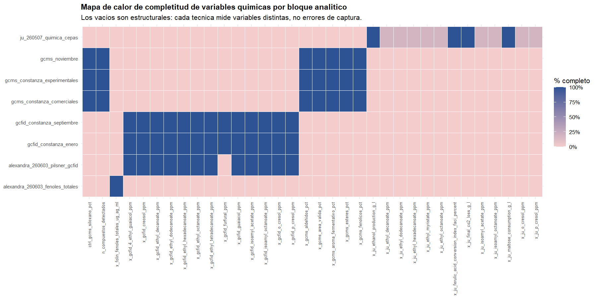{width=85%}

El mapa de completitud confirma que los vacíos de la matriz son principalmente estructurales y no errores de captura. Cada bloque analítico mide un conjunto distinto de variables: los bloques GC-FID concentran información en compuestos cuantificados por FID, los bloques GC-MS en variables derivadas de cromatografía de gases acoplada a espectrometría de masas, el bloque JU en variables fermentativas y el bloque Folin en fenoles totales. Por esta razón, no tendría sentido exigir que todos los bloques tengan datos en todas las columnas. Lo relevante es observar la completitud dentro de cada bloque. En ese sentido, GC-FID y GC-MS presentan alta cobertura en sus propias variables, mientras que JU muestra una cobertura más parcial en algunas variables específicas. Esta estructura justifica que el análisis exploratorio se realice por bloque y no como una matriz química única.

### Distribuciones (histogramas y boxplots) por bloque

Los histogramas muestran la forma de cada variable (¿se concentra en un rango, o está dispersa? ¿hay más de un grupo de valores?) y los boxplots resumen lo mismo de forma más compacta, marcando como punto aparte cualquier valor que quede fuera de 1.5 veces el rango intercuartílico. Con tamaños de muestra tan chicos por bloque (entre 2 y 39 unidades), es normal que las distribuciones se vean discretas o con "huecos" en vez de curvas suaves — eso no es un error, es la consecuencia directa de trabajar en un contexto de *small data*.

#### Histogramas

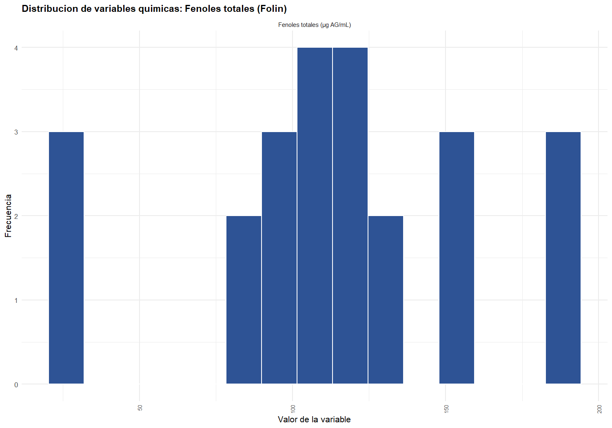{width=85%}

El histograma de fenoles totales muestra una distribución amplia, con valores concentrados principalmente entre rangos intermedios, pero también con grupos de muestras en valores bajos y altos. Esto indica que las muestras no presentan un nivel homogéneo de fenoles totales, sino que existe variabilidad química relevante entre ellas. La mayor parte de los valores se ubica aproximadamente en la zona media de la distribución, mientras que algunos casos aparecen bastante más bajos o más altos. Esta dispersión es útil para el análisis, ya que los fenoles totales pueden relacionarse con diferencias en carácter fenólico, tostado, amaderado o potencialmente ahumado.

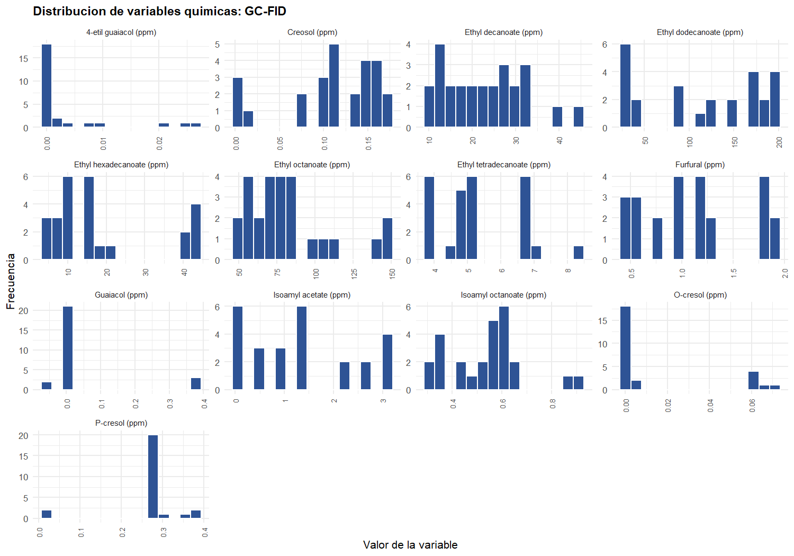{width=85%}

Los histogramas del bloque GC-FID muestran comportamientos distintos entre compuestos. Algunos, como guaiacol, 4-ethyl guaiacol, o-cresol y p-cresol, tienen muchas observaciones concentradas en valores muy bajos y pocos casos con concentraciones más altas, lo que sugiere que estos compuestos no aparecen con la misma intensidad en todas las muestras. En cambio, varios ésteres, como ethyl decanoate, ethyl dodecanoate, ethyl octanoate e isoamyl acetate, presentan rangos más amplios y distribuciones más dispersas. Esto refleja que el bloque GC-FID captura diferencias relevantes entre perfiles químicos, especialmente en compuestos asociados a familias fenólicas y fermentativas.

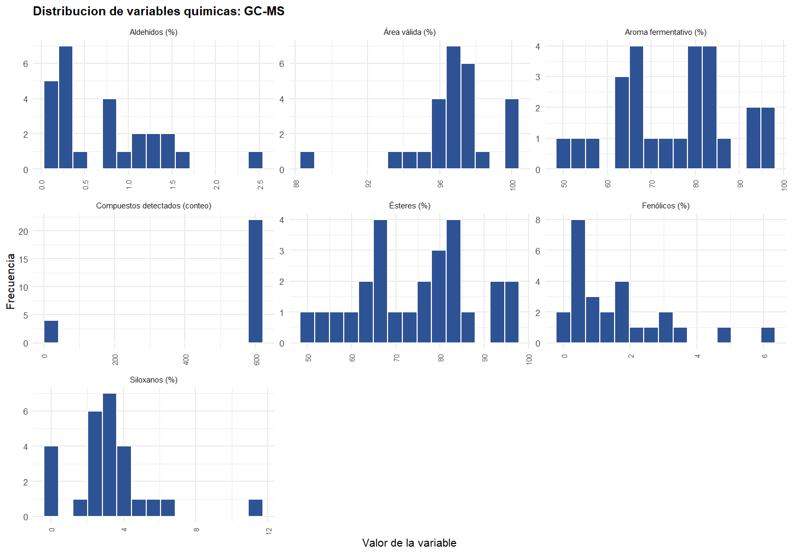{width=85%}

Los histogramas del bloque GC-MS reflejan una mezcla entre variables químicas interpretables y variables de control del proceso cromatográfico. El área válida se concentra en valores altos, cercanos al 96–100%, lo que sugiere que en la mayoría de los casos gran parte de la señal fue considerada utilizable, mientras que la variable de siloxanos presenta mayor dispersión, con algunos valores altos que podrían indicar ruido instrumental o contaminación de columna. En particular, el número de compuestos detectados muestra una diferencia marcada entre un grupo cercano a 600 y otros casos considerablemente más bajos, lo que refleja diferencias entre las distintas fuentes de datos GC-MS. Las variables de ésteres y aroma fermentativo presentan distribuciones con rangos amplios, mientras que los fenólicos se concentran mayoritariamente en valores bajos, por lo que estas últimas deben interpretarse como señales químicas puntuales dentro del bloque y no como un patrón dominante.

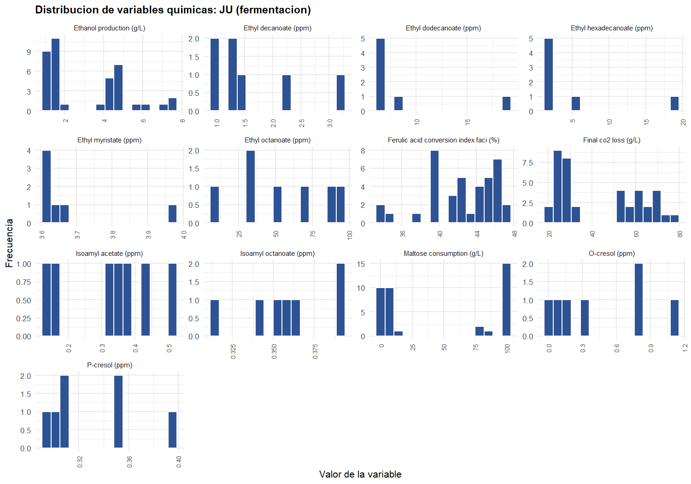{width=85%}

Los histogramas del bloque JU reflejan alta variabilidad entre variables fermentativas. La producción de etanol, la pérdida final de CO₂ y el consumo de maltosa muestran distribuciones amplias, lo que sugiere diferencias importantes entre condiciones experimentales de fermentación. En particular, el consumo de maltosa aparece dividido entre valores bajos y valores cercanos al máximo, lo que podría indicar fermentaciones con distinto grado de avance o eficiencia. Los ésteres del bloque JU presentan distribuciones más discretas y, en algunos casos, con pocos valores disponibles, por lo que deben interpretarse como señales exploratorias del perfil fermentativo y no como patrones concluyentes.

#### Boxplots

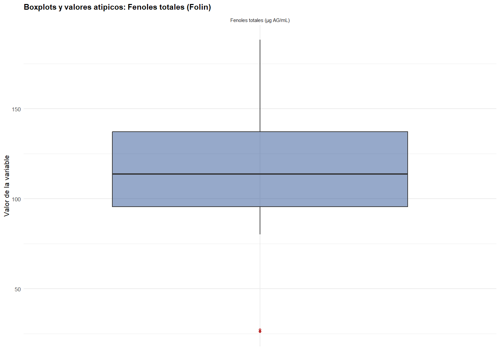{width=85%}

El boxplot de fenoles totales muestra una mediana ubicada en un rango intermedio, con una dispersión considerable entre muestras. La caja concentra la mayor parte de los valores aproximadamente entre niveles medios y altos, mientras que aparece un valor bajo marcado como atípico según la regla IQR. Este punto no debe interpretarse automáticamente como error, ya que puede corresponder a una muestra con menor contenido real de fenoles totales. En este estudio, el valor se documenta como atípico, pero se mantiene en la matriz para no alterar artificialmente la variabilidad química observada.

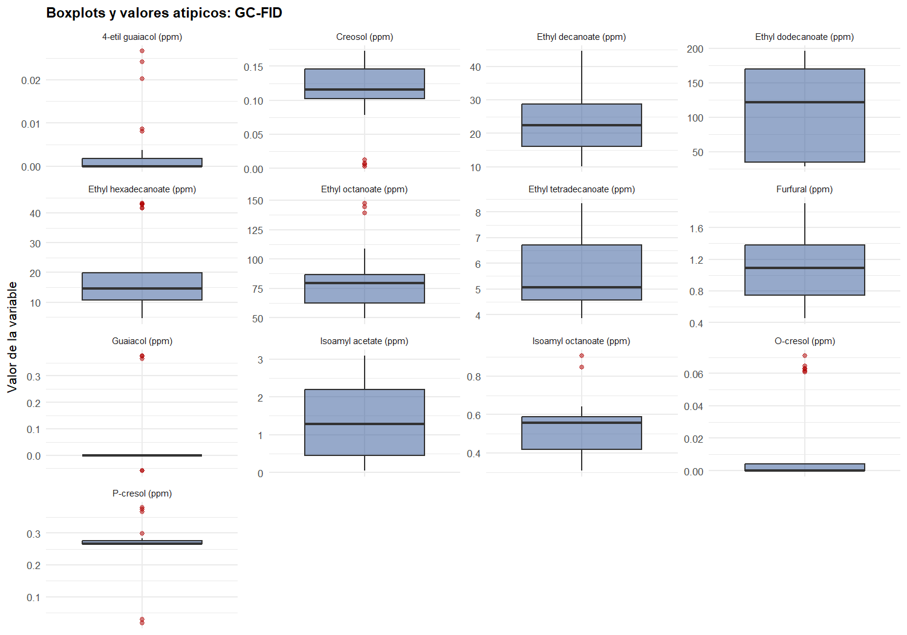{width=85%}

Los boxplots del bloque GC-FID muestran varios valores atípicos, especialmente en compuestos fenólicos como 4-ethyl guaiacol, guaiacol, o-cresol y p-cresol, además de algunos ésteres como ethyl hexadecanoate, ethyl octanoate e isoamyl octanoate. Esto indica que ciertas muestras tienen concentraciones químicas claramente distintas respecto del grupo central. En algunos compuestos, la mayoría de los valores se concentra cerca de cero y solo unas pocas muestras presentan valores elevados, lo que explica la aparición de atípicos. Dado que son mediciones químicas reales y el tamaño muestral es reducido, estos puntos se conservan y se interpretan como posibles señales diferenciadoras entre muestras, no como datos a eliminar automáticamente.

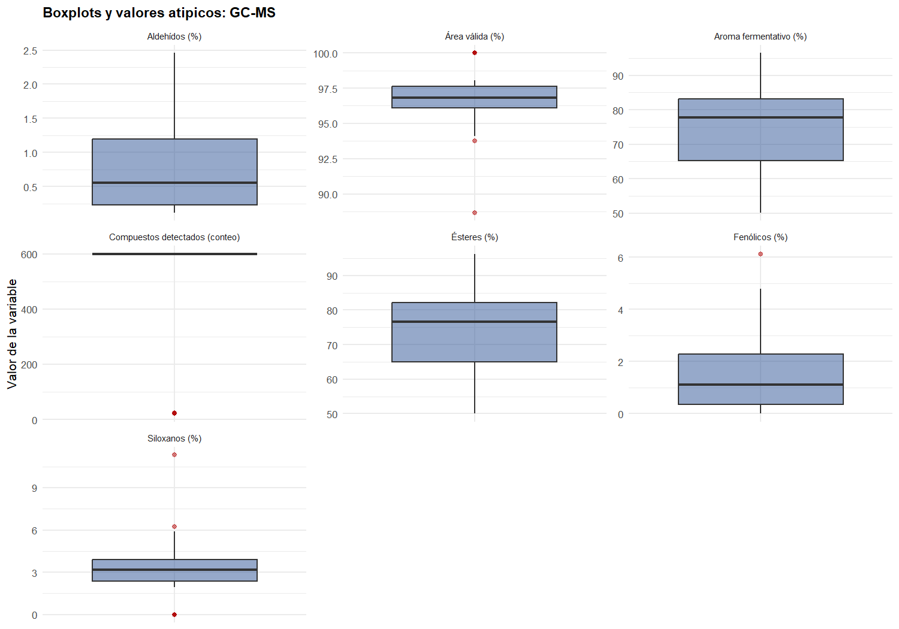{width=85%}

Los boxplots del bloque GC-MS muestran atípicos en variables de control y resumen, como siloxanos, área válida y número de compuestos detectados. En particular, la variable de siloxanos presenta valores extremos altos y bajos, lo que refuerza su utilidad como indicador de ruido instrumental o contaminación cromatográfica. El número de compuestos detectados también muestra una separación fuerte, probablemente asociada a diferencias entre fuentes de datos GC-MS. Las variables de ésteres y aroma fermentativo presentan rangos amplios, mientras que los fenólicos muestran un valor alto marcado como atípico. En conjunto, estos resultados indican que el bloque GC-MS debe interpretarse con cautela, distinguiendo entre señales químicas de interés y variables asociadas a la calidad del cromatograma.

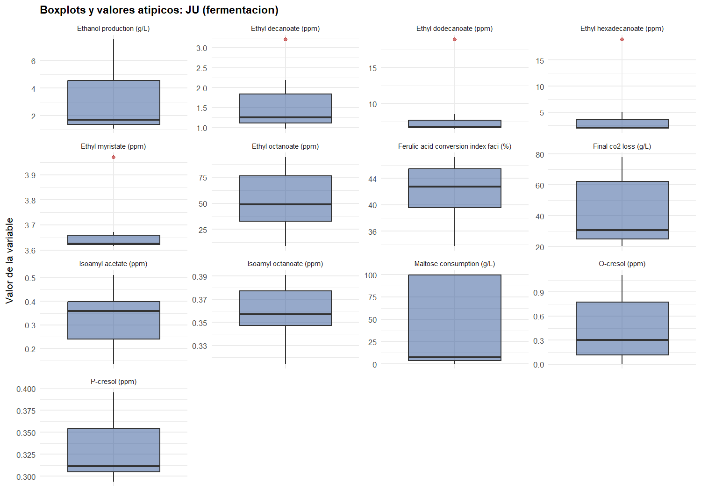{width=85%}

Los boxplots del bloque JU muestran que varias variables fermentativas tienen rangos amplios, especialmente producción de etanol, pérdida de CO₂, consumo de maltosa y ethyl octanoate. También aparecen valores atípicos puntuales en algunos ésteres, como ethyl decanoate, ethyl dodecanoate, ethyl hexadecanoate y ethyl myristate. Estos casos pueden representar condiciones experimentales específicas donde ciertos compuestos se produjeron en mayor proporción. En lugar de eliminarse, estos valores se mantienen como parte de la variabilidad del proceso fermentativo, ya que podrían ser relevantes para explicar diferencias químicas entre muestras.

Estos gráficos son el primer filtro visual para detectar candidatos a valor atípico, que luego se confirman formalmente con el test de Dixon en la siguiente sección.

### Valores atípicos: resumen clásico + test de Dixon

```{r quimico-outliers}
kable(read_excel("../data/procesamiento/analisis_quimico.xlsx", sheet = "06_resumen_outliers"))
```

```{r quimico-dixon}
kable(read_excel("../data/procesamiento/analisis_quimico.xlsx", sheet = "08_resumen_dixon"))
```

### Correlación entre variables químicas

Estos mapas de calor muestran la correlación de Pearson entre pares de variables **dentro de cada bloque** (no existe un mapa único global porque, como se vio en completitud, las variables de distintos bloques casi no comparten unidades para calcular una correlación válida). Sirven para anticipar colinealidad antes de modelar.

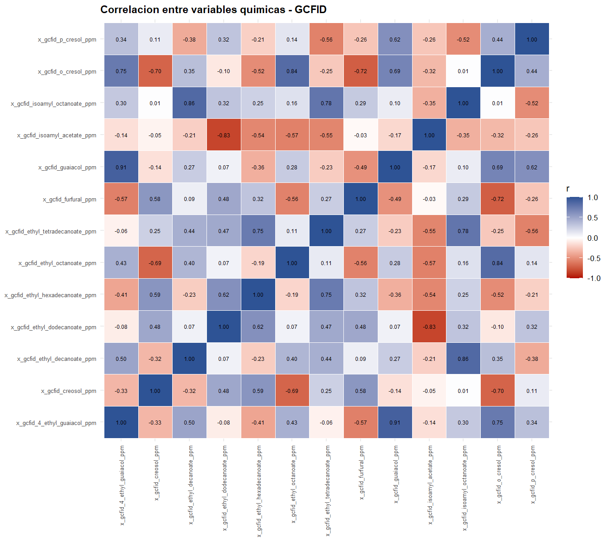{width=85%}

El mapa de correlación GC-FID muestra asociaciones importantes entre varios compuestos. Destaca la relación positiva entre 4-ethyl guaiacol y guaiacol, así como entre guaiacol y algunos cresoles, lo que sugiere que ciertos compuestos fenólicos tienden a variar de manera conjunta. También se observan correlaciones positivas entre varios ésteres, como ethyl decanoate, ethyl tetradecanoate e isoamyl octanoate, indicando posibles patrones compartidos dentro de la fracción fermentativa o aromática. Al mismo tiempo, aparecen correlaciones negativas relevantes, por ejemplo entre isoamyl acetate y ethyl dodecanoate, o entre furfural y algunos compuestos fenólicos. Esto confirma que las variables GC-FID no son independientes entre sí y que el modelamiento posterior debe considerar la colinealidad.

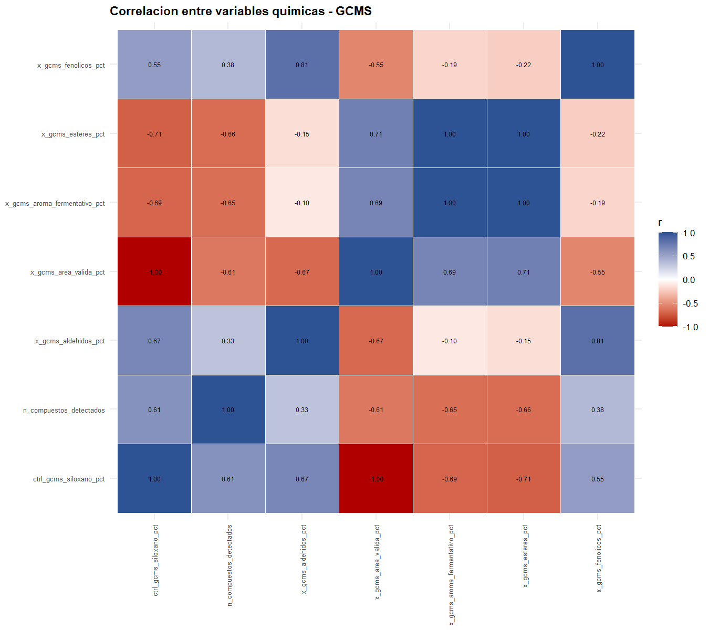{width=85%}

El mapa de correlación GC-MS muestra relaciones muy fuertes entre algunas variables, varias de ellas esperables por construcción. Por ejemplo, x_gcms_esteres_pct y x_gcms_aroma_fermentativo_pct presentan correlación perfecta, ya que el aroma fermentativo incluye directamente a los ésteres dentro de su cálculo. También destaca la correlación negativa perfecta entre siloxanos y área válida, lo que indica que cuando aumenta la proporción asociada a siloxanos disminuye la proporción de área considerada útil. Además, aldehídos y fenólicos muestran una correlación positiva alta, mientras que el área válida se relaciona positivamente con ésteres y aroma fermentativo. En conjunto, el bloque GC-MS combina variables químicas con variables de control de calidad de señal, por lo que sus correlaciones deben interpretarse considerando cómo fueron construidas.

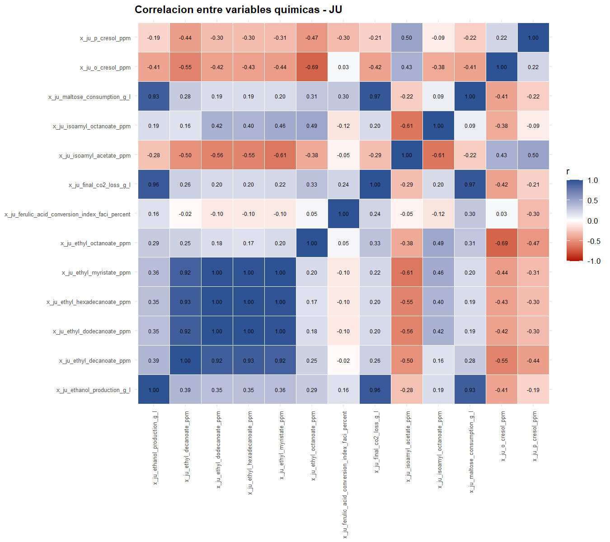{width=85%}

El mapa de correlación JU muestra una estructura interna muy marcada. Las variables asociadas a producción de etanol, pérdida de CO₂ y consumo de maltosa presentan correlaciones positivas altas, lo que es coherente con su relación directa dentro del proceso fermentativo. También se observan correlaciones muy fuertes entre varios ésteres de cadena larga, como ethyl decanoate, ethyl dodecanoate, ethyl hexadecanoate y ethyl myristate, lo que sugiere que estos compuestos tienden a aumentar o disminuir conjuntamente. En contraste, algunos cresoles presentan correlaciones negativas con variables fermentativas y con ciertos ésteres. Esto indica que el bloque JU no contiene variables aisladas, sino grupos de variables que representan procesos químicos conectados, aspecto que debe considerarse en el modelamiento para evitar interpretar señales redundantes como independientes.

Pares con correlación muy alta (por ejemplo, distintos ésteres de una misma familia química que suben y bajan juntos) son la razón por la que en el modelamiento se prefieren métodos regularizados (Ridge, PLS) en vez de una regresión lineal múltiple simple.

### Componentes principales (PCA/biplot) y atípicos multivariados (T²/Q-residual)

```{r quimico-pca-resumen}
kable(read_excel("../data/procesamiento/analisis_quimico.xlsx", sheet = "10_pca_resumen"))
```

La tabla muestra que el PCA no se calculó para el bloque de fenoles totales, ya que este bloque contiene solo una variable útil y el análisis de componentes principales requiere al menos dos variables. En los demás bloques, los dos primeros componentes resumen una proporción importante de la variabilidad: 63,8% en GC-FID, 87,2% en GC-MS y 64,5% en JU. Esto indica que, aunque cada bloque tiene varias variables químicas, una parte relevante de la estructura de los datos puede representarse en un plano bidimensional. Por esta razón, los biplots permiten visualizar de forma resumida qué variables empujan la separación entre muestras y qué unidades quedan más alejadas del grupo principal.

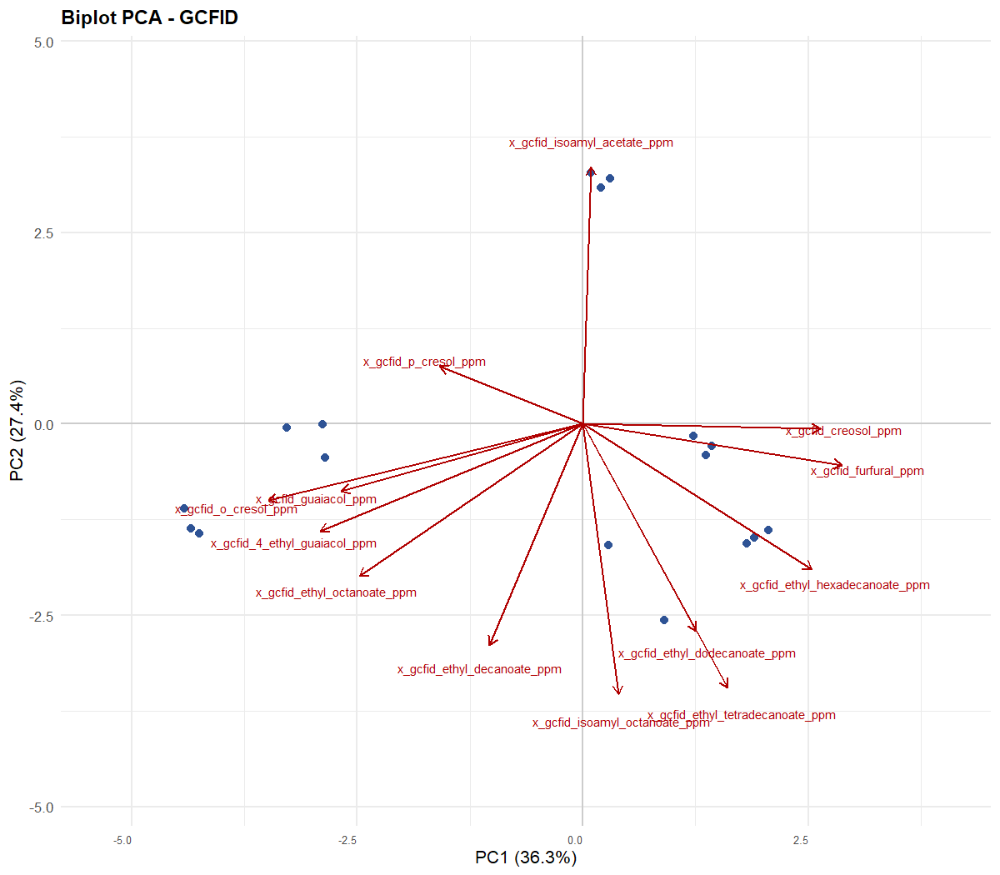{width=85%}

En el biplot del bloque GC-FID, el primer componente principal separa principalmente variables fenólicas ubicadas hacia la izquierda, como guaiacol, 4-ethyl guaiacol y o-cresol, de otras variables ubicadas hacia la derecha, como creosol, furfural y ethyl hexadecanoate. El segundo componente está fuertemente influido por isoamyl acetate, que aparece aislado hacia la parte superior, mientras que varios ésteres de cadena más larga, como ethyl decanoate, ethyl dodecanoate, ethyl tetradecanoate e isoamyl octanoate, se proyectan hacia la zona inferior. Esto sugiere que el bloque GC-FID distingue al menos tres patrones químicos: uno asociado a compuestos fenólicos, otro a ésteres de cadena larga y otro a isoamyl acetate. Las muestras se agrupan en zonas diferenciadas del plano, lo que indica que no todas presentan el mismo perfil químico dentro de este bloque.

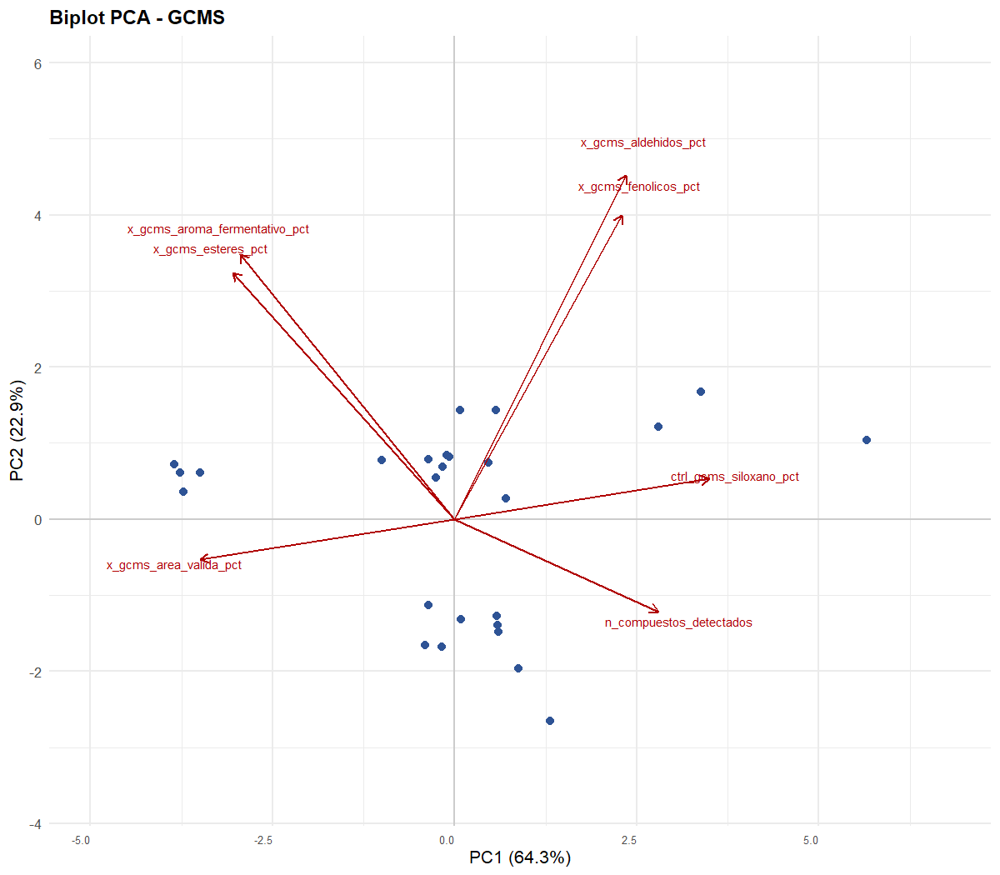{width=85%}

En el biplot GC-MS, el primer componente principal explica la mayor parte de la variabilidad del bloque y separa claramente las variables asociadas a área válida, ésteres y aroma fermentativo respecto de variables de control como siloxanos y número de compuestos detectados. Las variables `x_gcms_esteres_pct` y `x_gcms_aroma_fermentativo_pct` aparecen prácticamente superpuestas, lo que es esperable porque el aroma fermentativo incluye a los ésteres dentro de su cálculo. Por otra parte, aldehídos y fenólicos se proyectan juntos hacia la zona superior, indicando que tienden a variar en una dirección similar dentro de este bloque. La disposición de las muestras muestra algunos casos alejados hacia la derecha, asociados a mayor peso de siloxanos o número de compuestos detectados, por lo que este PCA refleja tanto diferencias químicas como diferencias en la calidad o estructura del cromatograma.

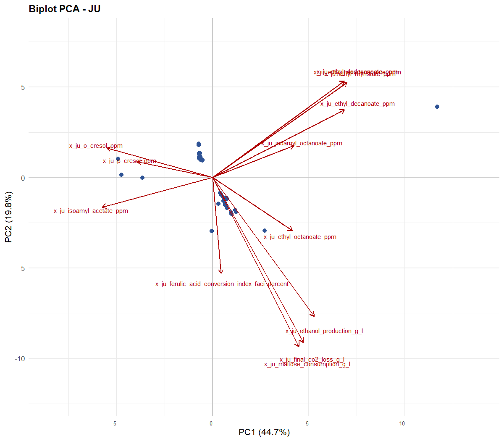{width=85%}

En el biplot del bloque JU se observa una separación clara entre grupos de variables fermentativas. Hacia la zona inferior derecha se agrupan variables directamente asociadas al avance de la fermentación, como producción de etanol, pérdida final de CO₂ y consumo de maltosa, lo que confirma que estas variables representan una señal común del proceso fermentativo. Hacia la zona superior derecha se proyectan varios ésteres, como ethyl decanoate, ethyl dodecanoate, ethyl hexadecanoate y ethyl myristate, indicando que estos compuestos tienden a comportarse de forma conjunta. En cambio, o-cresol, p-cresol e isoamyl acetate se ubican hacia la izquierda, sugiriendo un comportamiento distinto respecto del grupo principal de ésteres y variables fermentativas. Este resultado muestra que el bloque JU no solo captura intensidad fermentativa, sino también diferencias internas entre familias de compuestos.

Sobre esos mismos componentes se calcula la distancia T² de Hotelling (qué tan lejos está una unidad del centro, dentro del plano de los componentes usados) y el Q-residual (qué tan mal representada queda esa unidad por esos componentes) — el complemento multivariado al test de Dixon univariado.

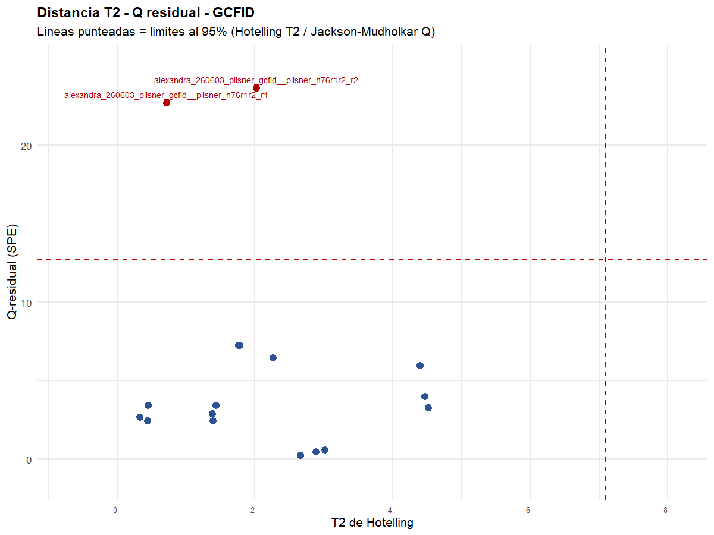{width=85%}

En el gráfico T²–Q residual del bloque GC-FID, la mayoría de las unidades queda dentro de los límites multivariados definidos al 95%, lo que indica que son razonablemente representadas por los componentes principales calculados. Sin embargo, las dos réplicas de la muestra Pilsner H76R1R2 aparecen por sobre el límite de Q-residual. Esto significa que no son necesariamente las más lejanas dentro del plano PCA, pero sí quedan mal representadas por los componentes principales usados. En términos prácticos, estas réplicas presentan una estructura química particular que el PCA no logra resumir completamente, por lo que se documentan como candidatas a atípicos multivariados, sin eliminarlas de la matriz.

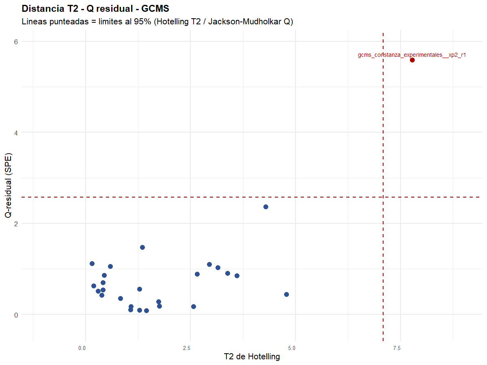{width=85%}

En el bloque GC-MS, la mayoría de las unidades se mantiene dentro de los límites de T² de Hotelling y Q-residual. No obstante, la muestra `gcms_constanza_experimentales__xp2_r1` queda fuera de ambos límites, lo que indica un comportamiento multivariado claramente distinto al resto. Al superar el límite de T², la muestra se ubica lejos del centro del espacio PCA; al mismo tiempo, al superar el límite de Q-residual, también queda mal representada por los componentes principales retenidos. Por lo tanto, esta unidad debe considerarse un caso atípico multivariado relevante dentro del bloque GC-MS. Aun así, se mantiene en la matriz y se documenta para revisión posterior, ya que puede reflejar una diferencia real de composición o de calidad cromatográfica.

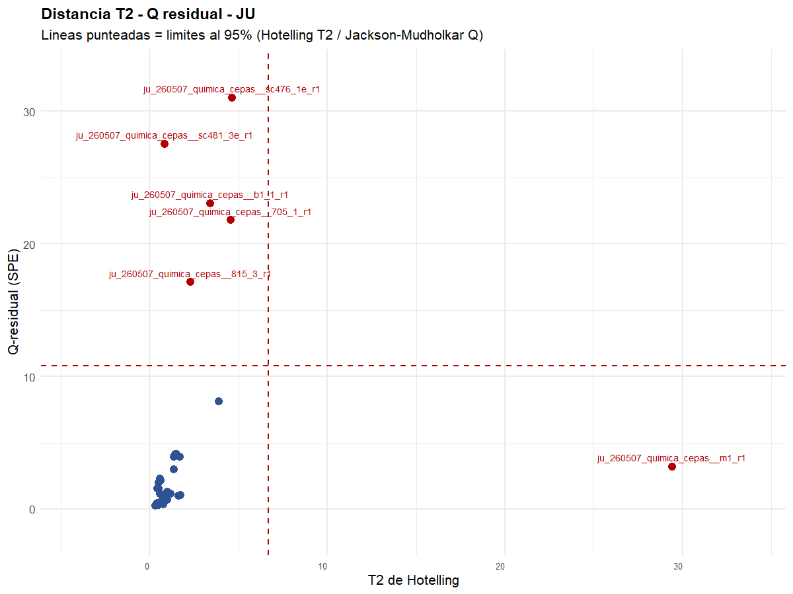{width=85%}

En el bloque JU se observa una mayor cantidad de unidades fuera de los límites multivariados. La muestra `ju_260507_quimica_cepas__m1_r1` destaca por superar ampliamente el límite de T² de Hotelling, lo que indica que se encuentra muy alejada del centro del espacio PCA, aunque no presenta un Q-residual elevado. Esto sugiere que es una muestra extrema, pero bien representada por los componentes principales. En cambio, otras unidades, como `sc476_1e_r1`, `sc481_3e_r1`, `b1_1_r1`, `705_1_r1` y `815_3_r1`, superan principalmente el límite de Q-residual, lo que indica que sus perfiles no quedan bien resumidos por el plano PCA. En conjunto, estos resultados muestran que el bloque JU tiene una estructura interna más heterogénea, probablemente asociada a diferencias reales entre cepas o condiciones fermentativas.

En conjunto, los análisis PCA y T²–Q residual permiten identificar patrones multivariados que no siempre son visibles en los análisis univariados. GC-FID muestra diferencias asociadas principalmente a compuestos fenólicos y ésteres; GC-MS combina señales químicas con variables de control cromatográfico; y JU presenta una estructura marcada por variables fermentativas y producción de ésteres. Los casos que superan los límites de T² o Q-residual se consideran unidades candidatas a revisión, pero no se eliminan automáticamente, ya que en un contexto de small data pueden representar diferencias químicas reales entre muestras. Por lo tanto, estos gráficos se utilizan como evidencia exploratoria para documentar perfiles particulares y orientar la interpretación del modelamiento posterior.

El detalle completo de las unidades que superan estos límites se muestra en la siguiente tabla:

```{r quimico-t2q}
kable(read_excel("../data/procesamiento/analisis_quimico.xlsx", sheet = "13_t2q_outliers"))
```

## Análisis exploratorio sensorial

```{r sensorial-resumen}
kable(read_excel("../data/procesamiento/analisis_sensorial.xlsx", sheet = "00_resumen"))
```

### Completitud y distribuciones de los targets sensoriales

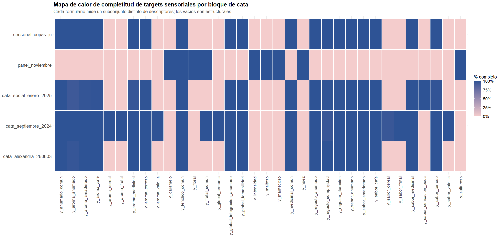{width=85%}

El mapa de completitud muestra que los datos faltantes en el bloque sensorial son principalmente estructurales. Esto ocurre porque cada sesión o formulario de cata evaluó un subconjunto distinto de descriptores, por lo que no todos los atributos están disponibles para todas las muestras. En este sentido, los vacíos no deben interpretarse como errores de registro, sino como diferencias propias del diseño de cada evaluación sensorial. La figura permite identificar qué targets tienen mayor cobertura entre sesiones y cuáles quedan restringidos a bloques específicos, aspecto importante antes de comparar o cruzar estos datos con las variables químicas.

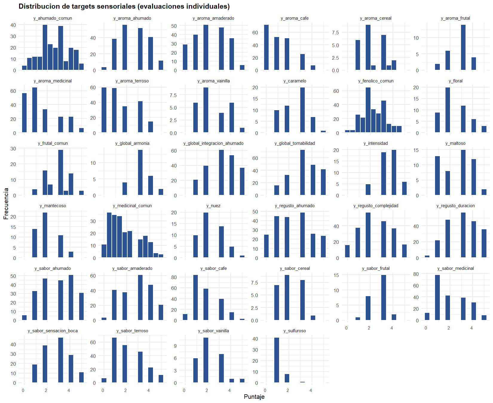{width=85%}

Los histogramas muestran la distribución de los puntajes individuales asignados por los catadores a cada descriptor sensorial. En general, varios atributos se concentran en valores bajos e intermedios, lo que indica que no todas las notas sensoriales aparecen con alta intensidad en las muestras evaluadas. Sin embargo, atributos como ahumado, fenólico, medicinal, amaderado, terroso, regusto ahumado y complejidad presentan mayor dispersión, lo que sugiere diferencias perceptibles entre muestras y catadores. Estas distribuciones permiten identificar qué targets tienen variabilidad suficiente para aportar información en análisis posteriores y cuáles podrían tener menor poder explicativo por estar demasiado concentrados en pocos puntajes.

### Distribuciones por sesión de cata

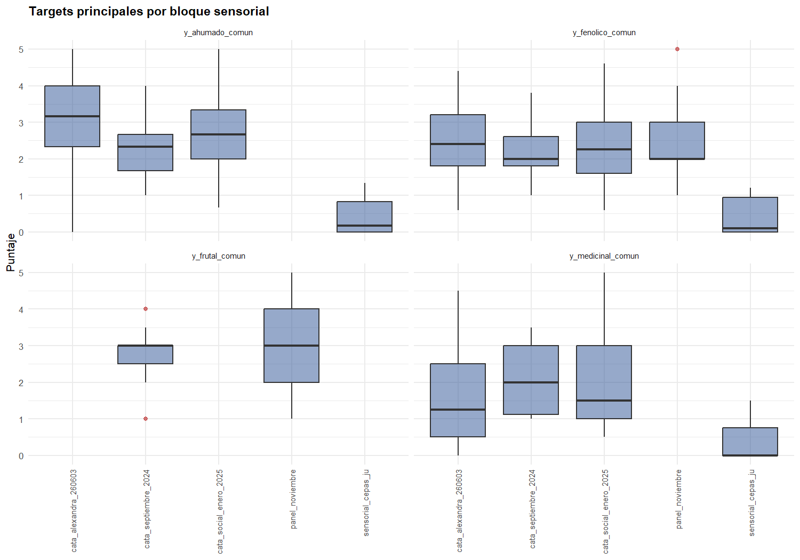{width=85%}

Los boxplots por bloque sensorial muestran que los puntajes de los atributos principales cambian según la sesión de cata. En variables como ahumado, fenólico, frutal y medicinal se observan diferencias en medianas y dispersión entre bloques, lo que indica que las evaluaciones no son completamente homogéneas entre sesiones. Esto puede deberse a diferencias en las muestras evaluadas, en el formulario utilizado o en el grupo de catadores. Por esta razón, los bloques sensoriales deben analizarse considerando su origen, evitando mezclar directamente sesiones que no midieron exactamente los mismos atributos bajo las mismas condiciones.

A nivel de muestra individual dentro de cada sesión (detalle en `outputs/exploratorio/sensorial/04_boxplots_muestra_*`), el patrón se repite: siempre hay una o dos muestras que se separan del resto en los atributos ahumado/fenólico/medicinal. El caso más claro es la **cata social de enero 2025**, que es también la única sesión que junta muestras comerciales (C1/Dalwhinnie, C2/Caol Ila) con las experimentales/locales (B1, C70, H76):

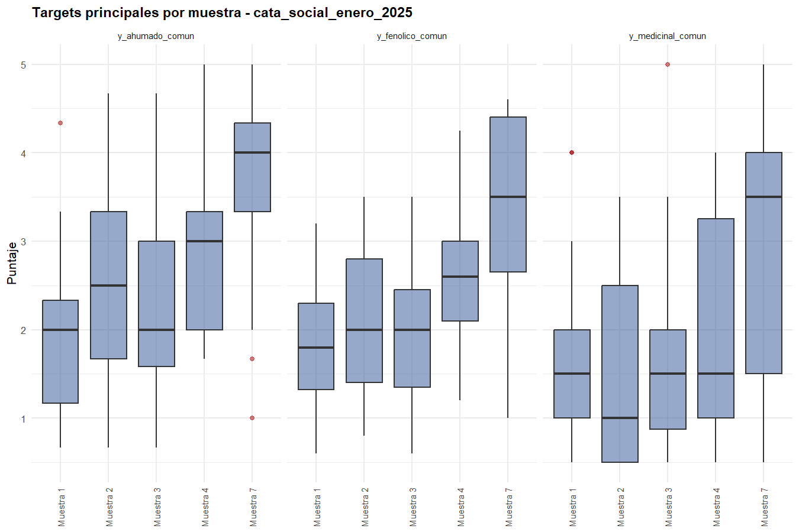{width=85%}

En la cata social de enero de 2025 se observa una mayor variabilidad entre muestras y catadores. La muestra 7 (C2/Caol Ila) destaca por presentar puntajes más altos en ahumado, fenólico y medicinal, lo que sugiere un perfil sensorial más marcado en atributos asociados a humo, compuestos fenólicos o notas medicinales. También se aprecia dispersión amplia en varias muestras, lo que es esperable en una cata social con distintos tipos de catadores. Esta figura muestra que algunas muestras fueron percibidas de forma más intensa y consistente, mientras que otras presentan evaluaciones más variables.

Las demás sesiones siguen el mismo patrón exploratorio con menor contraste: en `cata_alexandra_260603` la percepción fenólica y de ahumado crece de la muestra 1 a la 4; en `cata_septiembre_2024` la muestra 3 se percibe más intensa en ahumado, fenólico y frutal; en `panel_noviembre` la muestra 5 destaca en fenólico y las muestras 2/4/5 en frutal; y en `sensorial_cepas_ju` los puntajes son más acotados y con menor dispersión, por lo que ese bloque se trata como una señal exploratoria adicional y no como una caracterización sensorial robusta.

### Correlación entre targets sensoriales

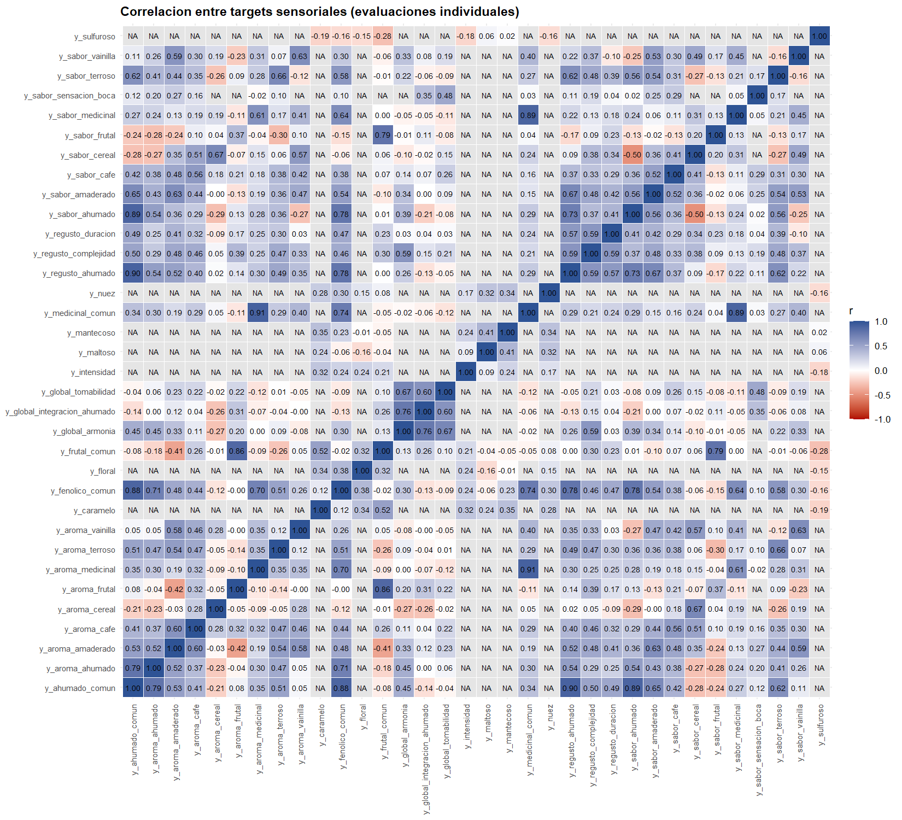{width=85%}

El mapa de correlación muestra que varios targets sensoriales están relacionados entre sí. Destacan asociaciones positivas entre atributos como ahumado, aroma ahumado, sabor ahumado, regusto ahumado, fenólico y medicinal, lo que indica que estos descriptores tienden a aumentar conjuntamente en las evaluaciones. Esto sugiere la presencia de una dimensión sensorial común asociada al carácter ahumado-fenólico del whisky. También se observan correlaciones entre atributos de sabor, aroma y regusto, aunque no todos los descriptores se relacionan con la misma intensidad. La presencia de valores NA se debe a que no todos los atributos fueron evaluados en todas las sesiones, por lo que estas correlaciones deben interpretarse como evidencia exploratoria y no como relaciones definitivas.

### Categoría de catador: perfil y concordancia (ICC)

Esta sección usa el campo "categoría de catador" (experto/sommelier, aficionado al whisky, consumidor general de destilados), registrado en el cuestionario de cada cata. Se usa para dos cosas: ver si el promedio de puntaje cambia según el tipo de catador, y medir qué tan de acuerdo están entre sí los catadores de una misma categoría.

**Perfil por muestra y categoría**: para cada muestra, categoría de catador y target sensorial se calcula el número de evaluaciones, el promedio y la desviación estándar. Por su tamaño (285 combinaciones muestra–categoría–target), se muestran solo las primeras filas a modo de ejemplo; el detalle completo está en `data/procesamiento/analisis_sensorial.xlsx`, hoja `16_perfil_categoria_catador`.

```{r catador-perfil}
kable(head(read_excel("../data/procesamiento/analisis_sensorial.xlsx", sheet = "16_perfil_categoria_catador"), 8))
```

**Concordancia entre catadores (ICC)**: para saber si los catadores de una misma categoría puntúan de forma parecida entre sí (y no solo si su promedio es distinto), se calculó el ICC1 (coeficiente de correlación intraclase, modelo de un factor aleatorio) por categoría y target. Valores cercanos a 1 indican alta concordancia dentro del grupo; valores cercanos a 0 indican que incluso catadores de la misma categoría difieren bastante entre sí.

```{r catador-icc}
kable(read_excel("../data/procesamiento/analisis_sensorial.xlsx", sheet = "22_concordancia_catador"))
```

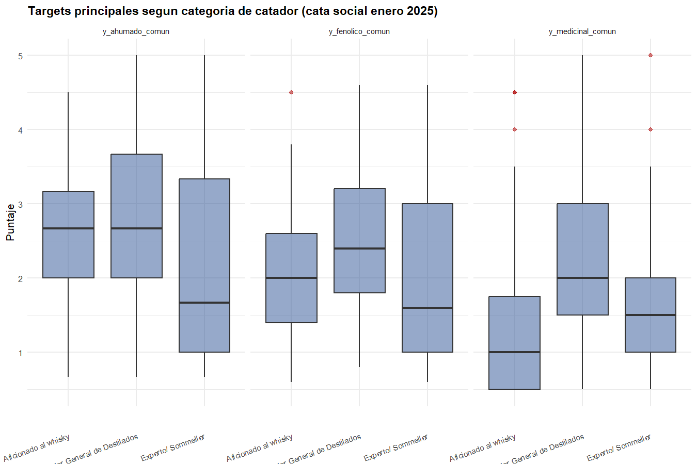{width=85%}

Los boxplots por categoría de catador muestran que existen diferencias en la forma en que los grupos evaluaron los atributos principales. En ahumado, los consumidores generales de destilados presentan una distribución amplia, mientras que expertos/sommelier y aficionados al whisky muestran también alta variabilidad interna. En fenólico y medicinal se observan diferencias de mediana entre categorías, pero también una dispersión considerable dentro de cada grupo. Esto indica que la categoría del catador puede influir en la evaluación, aunque no permite establecer conclusiones firmes debido al tamaño reducido y al posible desbalance entre categorías. Por ello, esta variable se usa como referencia descriptiva del panel.

### Perfiles sensoriales (radar) por muestra — caso destacado

Se generó un gráfico de radar por muestra y por dimensión sensorial (aroma, sabor, regusto final) para cada sesión de cata, automatizando lo que antes se armaba manualmente en Excel; el set completo está en `outputs/exploratorio/sensorial/` (archivos `07_radar_*`). Se muestra aquí la sesión **social de enero 2025**, por ser la única que compara directamente muestras comerciales (C1/Dalwhinnie, C2/Caol Ila) con las experimentales/locales (B1, C70, H76), lo que la hace la más ilustrativa del conjunto.

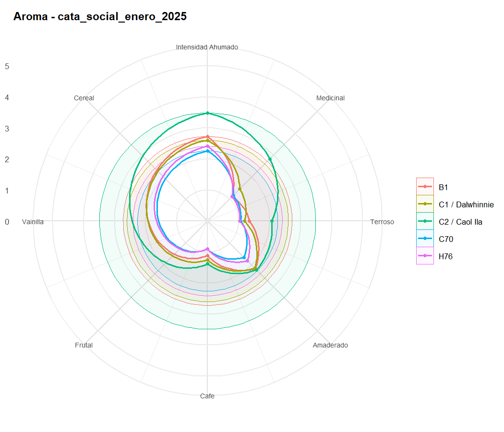{width=60%}

El radar de aroma de la cata social de enero de 2025 muestra una separación clara entre las muestras. C2/Caol Ila presenta el perfil aromático más amplio, destacando en intensidad de ahumado, medicinal, terroso, cereal, vainilla, café y amaderado. Esto es coherente con un whisky comercial de perfil más ahumado o intenso. C1/Dalwhinnie también muestra un perfil relativamente alto, aunque menor que C2. En cambio, B1, C70 y H76 presentan perfiles más moderados y cercanos entre sí. Este gráfico permite observar que las muestras comerciales se diferencian con claridad de las experimentales o locales en varios atributos aromáticos.

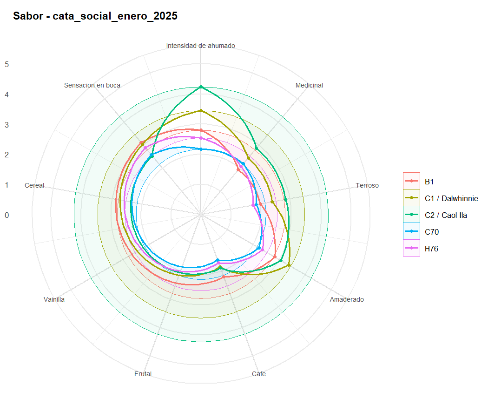{width=60%}

El radar de sabor de la cata social de enero de 2025 muestra que C2/Caol Ila presenta el perfil más intenso y amplio entre las muestras, especialmente en ahumado, medicinal, terroso, cereal, vainilla, frutal, café y sensación en boca. C1/Dalwhinnie aparece como una segunda muestra de perfil elevado, aunque menos extrema que C2. Las muestras B1, C70 y H76 presentan valores más bajos, con perfiles más compactos. Esto indica que el bloque de sabor permite separar con claridad las muestras comerciales de mayor intensidad sensorial respecto de las demás.

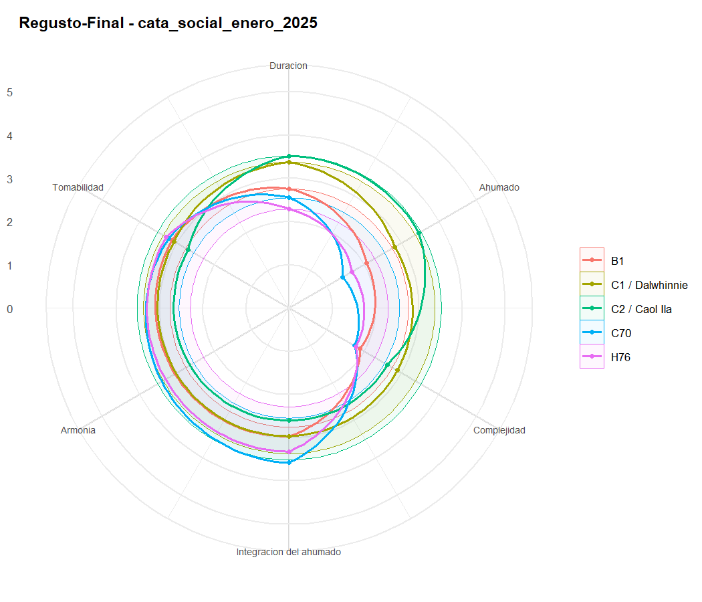{width=60%}

En el radar de regusto final de la cata social de enero de 2025, C2/Caol Ila vuelve a destacar con valores altos en ahumado, complejidad, duración e integración del ahumado. C1/Dalwhinnie también presenta un perfil amplio, aunque algo menor. Las muestras B1, C70 y H76 se ubican en rangos más bajos o intermedios, especialmente en ahumado y complejidad. Este patrón sugiere que las muestras comerciales no solo fueron percibidas como más intensas en aroma, sino también con un regusto más persistente y estructurado.

Las demás sesiones (`cata_alexandra_260603`, `cata_septiembre_2024`, `panel_noviembre`, `sensorial_cepas_ju`) siguen la misma lógica de análisis por muestra y confirman el mismo patrón general: siempre hay una o dos muestras que se distinguen del resto en intensidad ahumada/fenólica/medicinal, mientras que el bloque `sensorial_cepas_ju` en particular muestra señales más acotadas y debe interpretarse como exploratorio por su menor cantidad de evaluaciones.

### Perfiles sensoriales por categoría de catador — caso destacado

De forma análoga, se generó un radar por categoría de catador (experto/sommelier, consumidor general, aficionado al whisky) para cada muestra, disponible en `outputs/exploratorio/sensorial/` (archivos `08_radar_categoria_*`). Se muestra **C2/Caol Ila**, donde la diferencia entre categorías es más marcada.

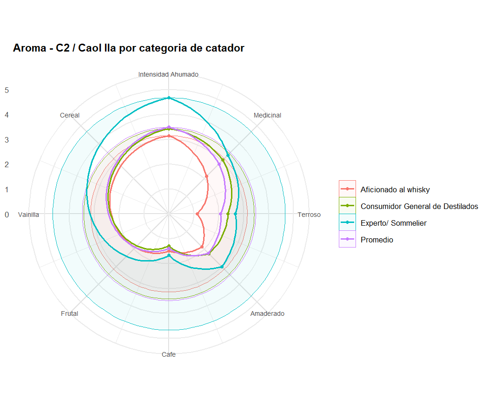{width=60%}

El radar de aroma de C2/Caol Ila muestra que los expertos/sommelier asignan puntajes claramente más altos que el resto de las categorías en casi todos los atributos, especialmente en intensidad de ahumado, medicinal, terroso, cereal, vainilla, frutal y café. Esto es coherente con un perfil comercial más marcado y complejo, probablemente más reconocible para catadores entrenados. Los consumidores generales y aficionados también perciben estas notas, pero con menor intensidad. El promedio queda por debajo del perfil experto, lo que indica que la lectura de C2/Caol Ila varía considerablemente según la experiencia del catador.

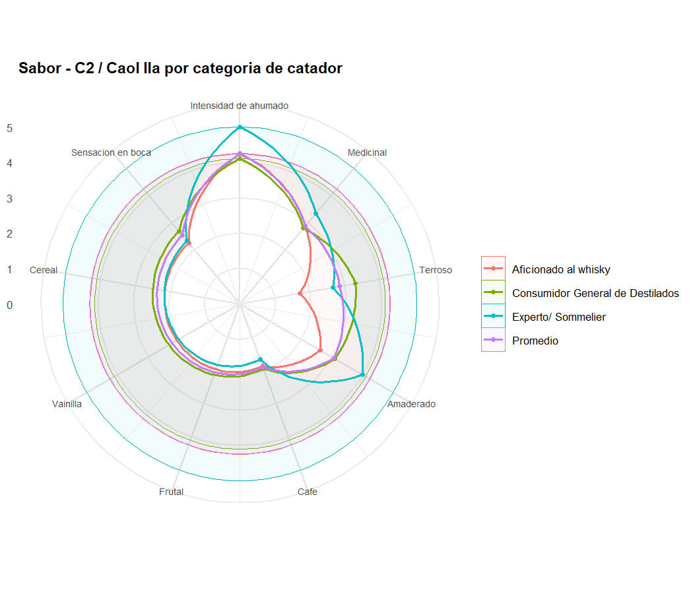{width=60%}

El radar de sabor de C2/Caol Ila muestra el perfil más intenso entre las muestras analizadas por categoría. Los expertos/sommelier asignan valores altos en intensidad de ahumado, cereal, vainilla, amaderado, sensación en boca y otros atributos, mostrando una lectura sensorial amplia de la muestra. Los consumidores generales y el promedio también presentan perfiles relativamente altos, aunque menos extremos. Los aficionados al whisky tienden a puntuar más bajo algunos atributos como medicinal, terroso y café. En conjunto, el gráfico confirma que C2/Caol Ila se diferencia por un sabor más intenso, complejo y marcado, especialmente en atributos ahumados y amaderados.

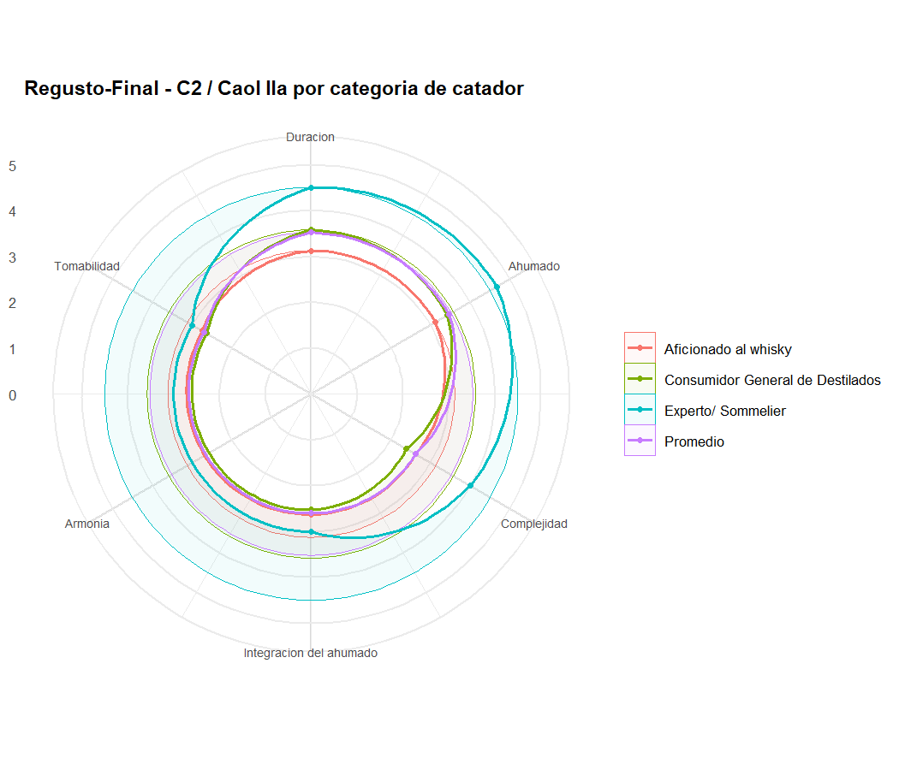{width=60%}

En el radar de regusto final de C2/Caol Ila, los expertos/sommelier vuelven a destacar con los puntajes más altos en duración, ahumado, complejidad, integración del ahumado, armonía y tomabilidad. Las demás categorías presentan perfiles más bajos y cercanos entre sí, aunque mantienen valores relativamente altos en comparación con otras muestras. Esto sugiere que C2/Caol Ila fue percibida como una muestra con regusto persistente y estructurado, especialmente por los catadores expertos. La diferencia entre categorías refuerza que el nivel de experiencia puede influir en la detección de atributos de final sensorial.

En las demás muestras (B1, C1/Dalwhinnie, C70, H76) la categoría de catador también influye, pero con diferencias más moderadas y sin un patrón tan marcado como en C2/Caol Ila: en general los expertos tienden a puntuar con mayor exigencia o detalle en atributos específicos (amaderado en C1/Dalwhinnie, sensación en boca en C70), mientras que consumidores generales y aficionados entregan perfiles más amplios pero menos diferenciados entre sí.

### Componentes principales sensoriales y atípicos multivariados

```{r sensorial-pca, results='asis'}
incluir_figuras("../outputs/exploratorio/sensorial", "^09_biplot_pca_sensorial")
incluir_figuras("../outputs/exploratorio/sensorial", "^10_distancia_t2_q")
```

```{r sensorial-t2q}
kable(read_excel("../data/procesamiento/analisis_sensorial.xlsx", sheet = "23_t2q_outliers"))
```

## Cruce químico-sensorial

Esta sección cruza, de forma exploratoria y previa al modelamiento formal, los predictores químicos con los targets sensoriales, usando correlación de Pearson por pares (`pairwise.complete.obs`) y exigiendo al menos 5 pares con dato disponible para reportar un valor. Se usa el escenario `M_pura` (34 unidades con química real y cata real agregada), y no reemplaza el diagnóstico de colinealidad ni los modelos supervisados de la Parte 3 — es solo una primera mirada a qué variables podrían estar asociadas antes de entrar a esos análisis formales.

```{r cruzado-resumen}
kable(read_excel("../data/procesamiento/analisis_cruzado_quimico_sensorial.xlsx", sheet = "00_resumen"))
```

La tabla resume el escenario usado, los 32 predictores químicos evaluados y los 4 targets sensoriales principales considerados (`y_frutal_comun`, `y_fenolico_comun`, `y_ahumado_comun`, `y_medicinal_comun`).

### Heatmap general: predictores químicos vs. targets principales

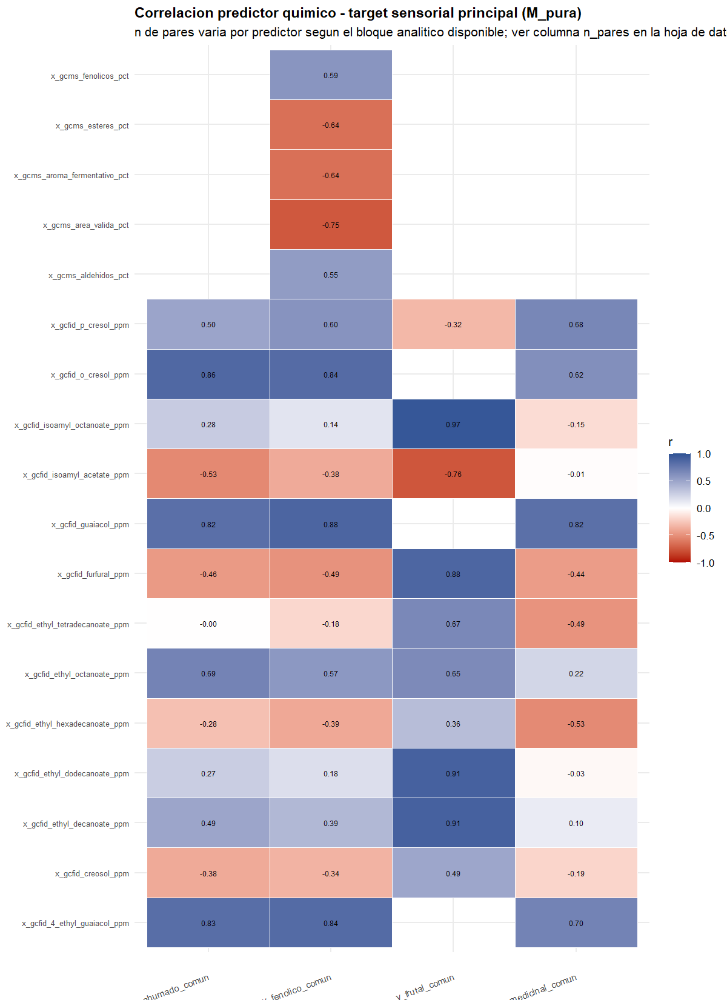{width=90%}

Este heatmap cruza los 32 predictores químicos contra los 4 targets principales. Las celdas en blanco indican que ese par no alcanzó el mínimo de 5 observaciones simultáneas para calcular una correlación confiable. Por eso solo aparecen valores para predictores de **GC-FID** (49 pares evaluados) y **GC-MS** (5 pares); los predictores de **JU** y **Folin** casi no se solapan con las unidades que tienen cata real dentro de `M_pura` y por lo tanto no alcanzan ese mínimo. Dentro de lo que sí se puede leer, destacan los fenoles volátiles de GC-FID — guaiacol, o-cresol, p-cresol y 4-etil-guaiacol — con correlaciones altas (r ≈ 0.7–0.9) tanto con `y_ahumado_comun` como con `y_fenolico_comun`, coherente con que estas mismas variables terminan siendo los predictores prioritarios en el modelamiento (Parte 4).

### Heatmaps por bloque analítico

Como los bloques químicos no comparten unidades analíticas entre sí (ver completitud, sección 2.2.1), conviene además mirar cada bloque por separado en vez de solo el heatmap combinado.

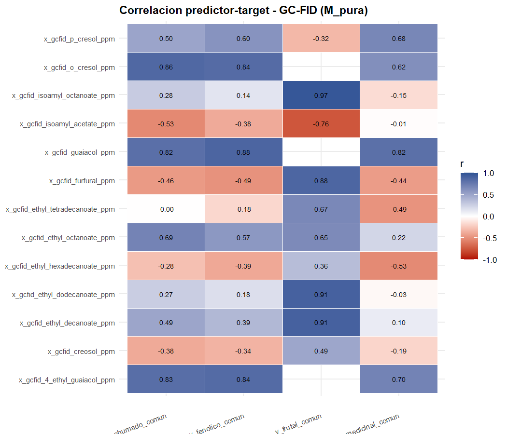{width=90%}

El bloque GC-FID es el que más cobertura aporta a este cruce (todos sus predictores alcanzan el mínimo de pares frente a los 4 targets principales). Se confirma el mismo patrón que en el heatmap general: los fenoles volátiles correlacionan fuerte y positivamente con ahumado/fenólico/medicinal, mientras que varios ésteres (isoamyl octanoate, ethyl dodecanoate, ethyl decanoate, furfural) muestran su correlación más alta con `y_frutal_comun` en vez de con el carácter ahumado.

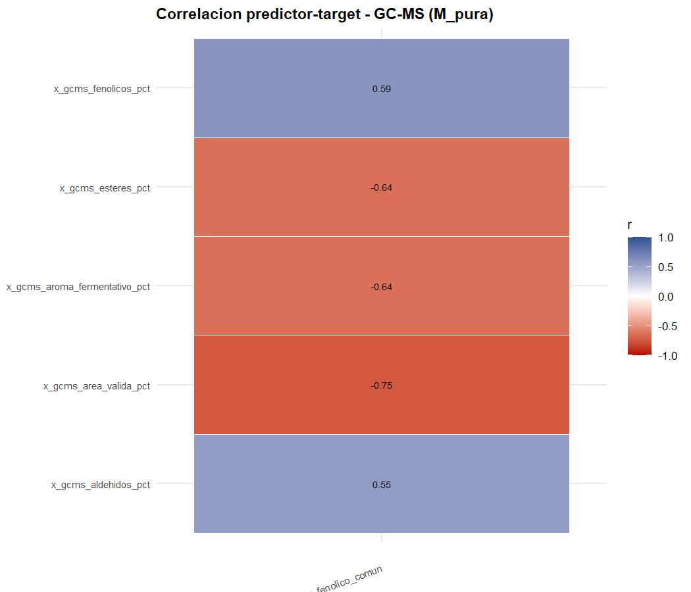{width=60%}

El bloque GC-MS solo alcanza el mínimo de pares frente a `y_fenolico_comun` (5 pares), por lo que es el único target con celda calculada para este bloque. El área válida y los ésteres/aroma fermentativo correlacionan negativamente con el fenólico (r ≈ -0.6 a -0.75), mientras que fenólicos y aldehídos correlacionan positivamente (r ≈ 0.55–0.59). Dado que son solo 5 pares, esta lectura es referencial y no debe compararse en fuerza con los resultados de GC-FID, que tienen bastante más respaldo muestral.

El bloque **JU** no genera un heatmap propio en este cruce: por definición, `M_pura` excluye la cata individual JU (ver Matriz 1 en la Parte 1), así que sus predictores fermentativos casi no se solapan con unidades que tengan cata real y no llegan al mínimo de 5 pares frente a ningún target. Para ver JU cruzado con sensorial hay que usar el escenario de sensibilidad `M_cata_individual` (Matriz 5, Parte 1), no este cruce exploratorio.

### Pares con correlación alta (|r| ≥ 0.5)

```{r cruzado-pares}
kable(read_excel("../data/procesamiento/analisis_cruzado_quimico_sensorial.xlsx", sheet = "03_pares_correlacion_alta"))
```

Esta tabla lista, ya no solo los 4 targets principales sino los 25 descriptores sensoriales individuales, todos los pares predictor-target con |r| ≥ 0.5 (129 pares en total, sobre 18 predictores distintos, todos de GC-FID o GC-MS). Varias de las correlaciones más altas (cercanas a 0.9–0.99) corresponden a pares con solo 8-9 observaciones — típicamente contra `y_frutal_comun`, que tiene cobertura baja (13/34 unidades) — por lo que ese valor tan alto es en gran parte un efecto de tamaño de muestra pequeño y no debe leerse como una relación fuerte y confiable. Esta tabla es un insumo temprano de exploración, no una lista de importancia de variables: esa evaluación formal se hace recién en el modelamiento (Parte 3), con validación cruzada y bootstrap.

# - MODELAMIENTO {.parte}

## Objetivo de esta parte

Esta parte documenta la etapa de **modelamiento predictivo**: diagnóstico de viabilidad y colinealidad de los predictores, ajuste de modelos candidatos y su validación por bootstrap agrupado, además del análisis de sensibilidad a valores atípicos químicos. El target principal es `y_fenolico_comun` (cobertura completa, 34/34 en `M_pura`); se reporta también `y_frutal_comun` como target secundario exploratorio, ya que su baja cobertura (13/34) deja grados de libertad negativos en varios escenarios y sus resultados no deben leerse con el mismo nivel de confianza.

Los escenarios evaluados son:

| Escenario | Filas | Rol |
|---|---:|---|
| `M_pura` | 34 | Principal — evidencia central de resultados |
| `M_cata_individual` | 52 | Sensibilidad — pura + cata individual JU agregada |
| `M_expandida_evaluador` | 685 | Complementario por evaluador (no independiente) |
| `M_ia_exploratoria` | 24 | Sintético exploratorio (no reemplaza cata real) |

Antes de mostrar los resultados de cada etapa, las siguientes dos secciones explican qué modelos se probaron y cómo se compensa, metodológicamente, tener tan pocas muestras con cata real.

## Modelos que se van a utilizar

Se prueban dos modelos base (piso mínimo de comparación) y seis modelos candidatos, todos evaluados sobre los mismos escenarios y targets:

**Modelos base:**

- **Media de entrenamiento**: predice siempre el promedio del target visto en entrenamiento, sin usar ninguna variable química. Es el piso absoluto: cualquier modelo candidato que no le gane no está aportando información real.
- **Regresión lineal reducida**: regresión lineal simple con hasta 3 predictores, elegidos por correlación con el target *dentro de cada fold* (para no filtrar información de test hacia el entrenamiento). Es un piso más exigente que la media, porque sí usa química, pero de forma muy simple.

**Modelos candidatos (small data):**

- **Ridge, Lasso y Elastic Net**: regresiones lineales regularizadas, que penalizan coeficientes grandes para controlar el sobreajuste cuando hay más predictores correlacionados que observaciones independientes — justamente el escenario de colinealidad que se documenta más abajo. Lasso y Elastic Net además pueden llevar coeficientes a cero, funcionando como selección de variables automática.
- **PLS (mínimos cuadrados parciales)**: en vez de usar los predictores originales, construye combinaciones lineales de ellos que maximizan su relación con el target, reduciendo la dimensionalidad antes de ajustar. Útil cuando hay muchos predictores correlacionados entre sí, como ocurre en los grupos GC-FID y GC-MS.
- **Random Forest restringido** (`ranger`) y **Gradient Boosting restringido** (`gbm`): modelos de árboles con su complejidad limitada a propósito (profundidad y número de árboles reducidos, `mtry` acotado) — un Random Forest o Gradient Boosting sin restricciones prácticamente memoriza el set de entrenamiento cuando hay 30-50 filas, así que se restringen para que generalicen en vez de sobreajustar.

Todos se ajustan con validación cruzada y se comparan primero con una pasada simple (sección "Modelos candidatos") y luego con el bootstrap agrupado, que es el que finalmente determina el modelo recomendado por escenario.

## Manejo del tamaño de muestra pequeño

En este estudio no se usan técnicas de aumento de datos sintéticas tipo SMOTE (pensadas para clasificación desbalanceada, no aplican a un target continuo con 34 muestras). En su lugar, el tamaño de muestra utilizable se maneja con tres estrategias complementarias:

1. **Escenarios adicionales que suman filas sin inventar química nueva.** `M_expandida_evaluador` no promedia los puntajes de los catadores por muestra, sino que deja una fila por evaluador (685 filas sobre las mismas 34 muestras químicas); `M_cata_individual` agrega las 18 filas de la cata individual JU a las 34 de la matriz pura. Ambos aportan más señal de entrenamiento, pero se validan agrupando por unidad química (ver punto 2) para no contar la misma muestra química varias veces como si fuera evidencia independiente.
2. **Validación por bootstrap agrupado** (sección más abajo): 100 iteraciones de remuestreo con reemplazo, agrupando por unidad analítica, de forma que todas las filas de una misma muestra química caen siempre juntas en entrenamiento o en prueba, nunca repartidas entre ambos. Esto evita una fuga de información que sobreestimaría el desempeño, y es la técnica central para exprimir al máximo los pocos datos disponibles sin inflar artificialmente los resultados.
3. **Regularización y restricción de modelos** (Ridge/Lasso/Elastic Net, árboles restringidos): con tan pocas observaciones no hay margen para dejar un conjunto de validación completamente aparte sin sacrificar datos de entrenamiento, así que el control de sobreajuste se hace principalmente dentro del propio modelo (penalización de coeficientes, profundidad limitada) en vez de con un split de datos más grande.

Con este marco definido, las siguientes secciones muestran los resultados de cada etapa.

## Diagnóstico de viabilidad por escenario

Antes de ajustar cualquier modelo se revisa una heurística de viabilidad — no un cálculo formal de un modelo específico, sino un chequeo rápido de EDA para *small data*: **grados de libertad aproximados = filas modelables (con dato no vacío en el target) − predictores usables** (predictores con al menos 3 valores, al menos 2 valores distintos y desviación estándar mayor que cero). Un valor negativo significa que hay más predictores que datos para estimarlos, y el ajuste no es confiable por más regularización que se use; valores por debajo de 15 quedan marcados como "alerta" y por debajo de 5 (u observaciones totales menores a 8) como "crítico".

```{r diagnostico-viabilidad}
kable(read_excel("../data/modelamiento/diagnostico_modelamiento.xlsx", sheet = "01_viabilidad_escenarios"))
```

```{r diagnostico-fig, results='asis'}
incluir_figuras("../outputs/modelamiento/diagnostico", "\\.png$")
```

Para `M_pura` con `y_fenolico_comun` (target principal) hay 34 filas modelables, 18 predictores usables y 16 grados de libertad aproximados — viable. Para `y_frutal_comun`, en cambio, solo 13 filas quedan modelables (baja cobertura), lo que con los mismos 18 predictores da grados de libertad negativos (-5) y una marca de `critico_gl_insuficiente`: por eso este target se reporta siempre como secundario/exploratorio y nunca como evidencia central.

## Colinealidad de predictores

Dado que los predictores provienen de técnicas analíticas no solapadas (GC-MS, GC-FID, Folin, JU fermentativo), no se aplica un VIF global; se usa correlación pareada de Pearson como diagnóstico principal, complementado con VIF por bloque y VIF del modelo base reducido.

```{r colinealidad-resumen}
kable(read_excel("../data/modelamiento/colinealidad_modelamiento.xlsx", sheet = "01_predictores_resumen"))
```

De las 32 variables químicas, en `M_pura` quedan **18 usables** para correlación; las otras 14 quedan fuera por `sin_datos` (todo el bloque JU salvo unos pocos compuestos, porque casi no se solapa con unidades que tienen cata real) o por `menos_de_3_valores` (muy pocos casos con dato para estimar una correlación mínimamente confiable).

```{r colinealidad-pares}
kable(read_excel("../data/modelamiento/colinealidad_modelamiento.xlsx", sheet = "02_pares_alta_correlacion"))
```

En `M_pura` hay **9 pares con correlación alta** (|r| ≥ 0.85), de los cuales **2 son muy altas** (r ≈ 0.96–1.00): los pares de variables agregadas de GC-MS que se construyen unas a partir de otras (`x_gcms_esteres_pct` con `x_gcms_aroma_fermentativo_pct`, y `x_gcms_fenolicos_pct` con `x_gcms_aldehidos_pct`), además de pares esperables entre compuestos químicamente emparentados (guaiacol y 4-etil-guaiacol; distintos ésteres de cadena larga). Esta es la razón concreta por la que se prefieren modelos regularizados o PLS en vez de una regresión lineal múltiple simple.

### Mapas de calor de colinealidad por escenario

Cada mapa muestra la correlación de Pearson entre los predictores químicos más involucrados en colinealidad (o, si no hay pares con |r| ≥ 0.85, los de mayor variabilidad), agrupados por bloque analítico — GC-FID, GC-MS, JU y Folin no comparten unidades entre sí, así que sus pares cruzados no tienen correlación calculable y se dejan en blanco en vez de rellenarse con gris.

**Escenario `M_pura`**

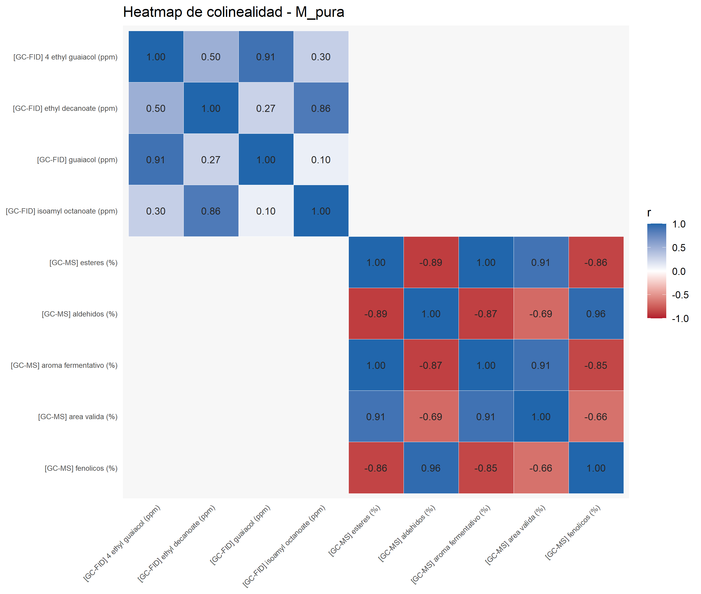{width=95%}

En el escenario principal, la colinealidad relevante se concentra en dos bloques. En GC-FID, los fenoles volátiles guaiacol y 4-etil-guaiacol correlacionan fuerte (r = 0.91) — moléculas químicamente emparentadas que suelen producirse juntas durante el tostado/ahumado — y por otro lado los ésteres ethyl decanoate e isoamyl octanoate (r = 0.86). En GC-MS, varias variables agregadas están construidas unas a partir de otras: ésteres y aroma fermentativo son casi la misma variable (r = 1.00, porque el aroma fermentativo incluye a los ésteres en su cálculo), y fenólicos correlaciona muy fuerte con aldehídos (r = 0.96). El bloque JU no aparece en este escenario porque, al excluir la cata individual, casi no tiene solapamiento suficiente con las 34 unidades de `M_pura`.

**Escenario `M_cata_individual`**

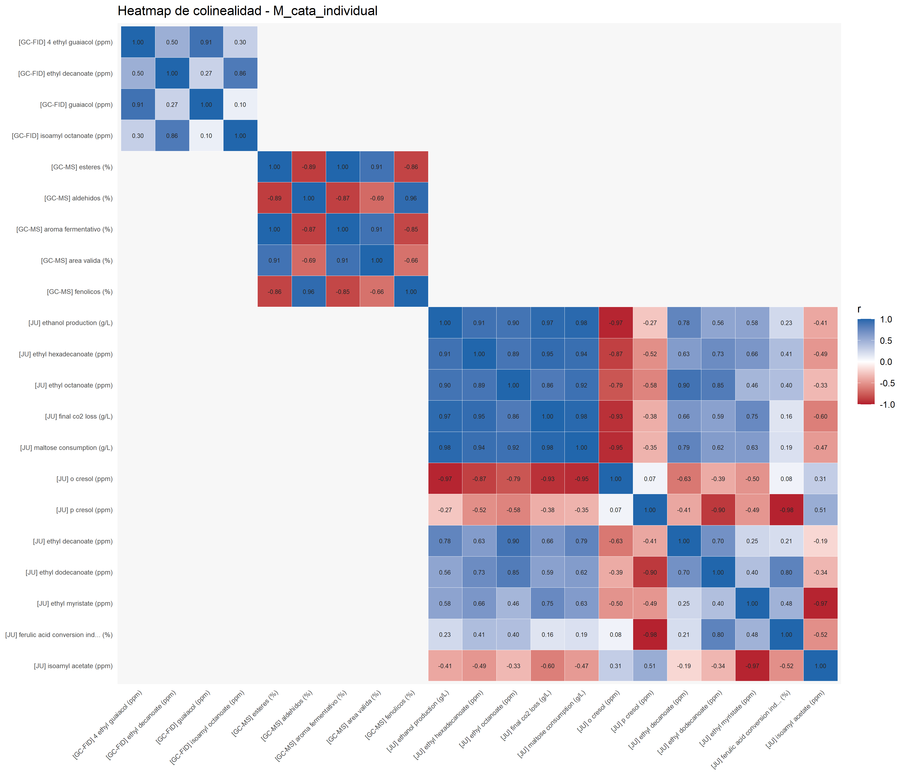{width=95%}

Al agregar la cata individual JU (52 filas), el bloque JU sí alcanza el umbral y aparece con 12 variables — es, por lejos, el bloque más internamente colineal: casi todas las variables fermentativas (producción de etanol, pérdida de CO₂, consumo de maltosa, varios ésteres de cadena larga) se mueven juntas con r > 0.85, coherente con que todas reflejan el mismo proceso de fermentación medido de distintas formas. o-cresol y p-cresol, en cambio, correlacionan negativamente con ese grupo (hasta r = -0.97), y p-cresol en particular con el índice FACI (r = -0.98) — señal de que estos dos compuestos siguen una dinámica distinta al resto de las variables JU. Los bloques GC-FID y GC-MS mantienen el mismo patrón que en `M_pura`, porque siguen siendo las mismas 34 muestras químicas de base.

**Escenario `M_expandida_evaluador`**

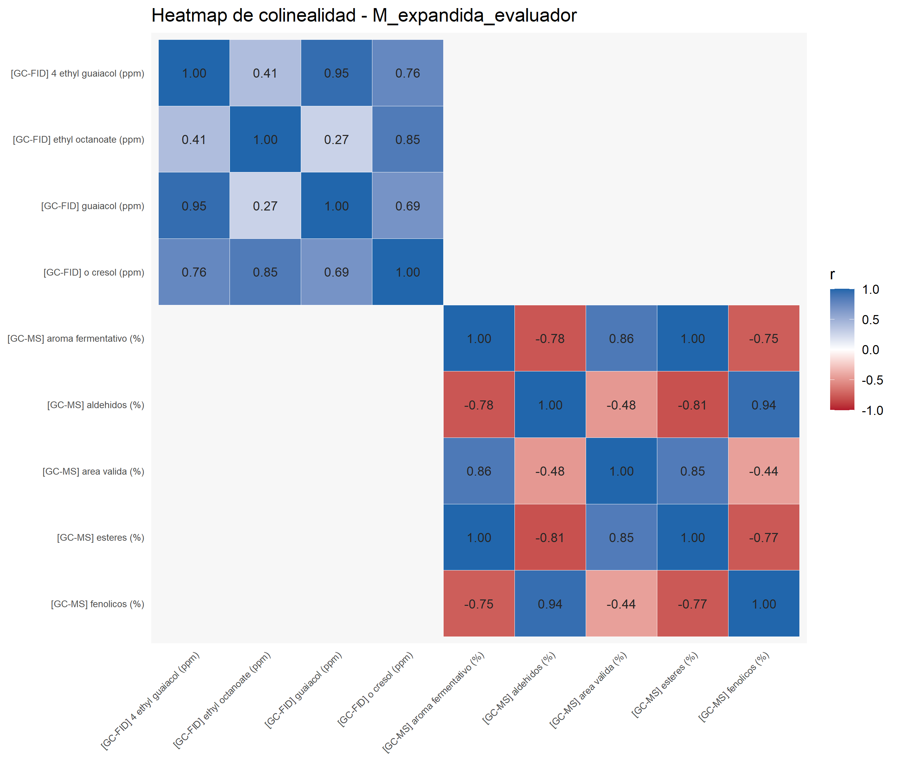{width=95%}

Como esta matriz repite las mismas 34 muestras químicas una vez por evaluador (685 filas), el patrón de colinealidad es esencialmente el mismo que en `M_pura` — se repiten los mismos dos bloques con valores muy similares (guaiacol y 4-etil-guaiacol suben incluso a r = 0.95). Esto confirma que la colinealidad es una propiedad de la química de las muestras, no del número de evaluadores que las calificaron.

**Escenario `M_ia_exploratoria`**

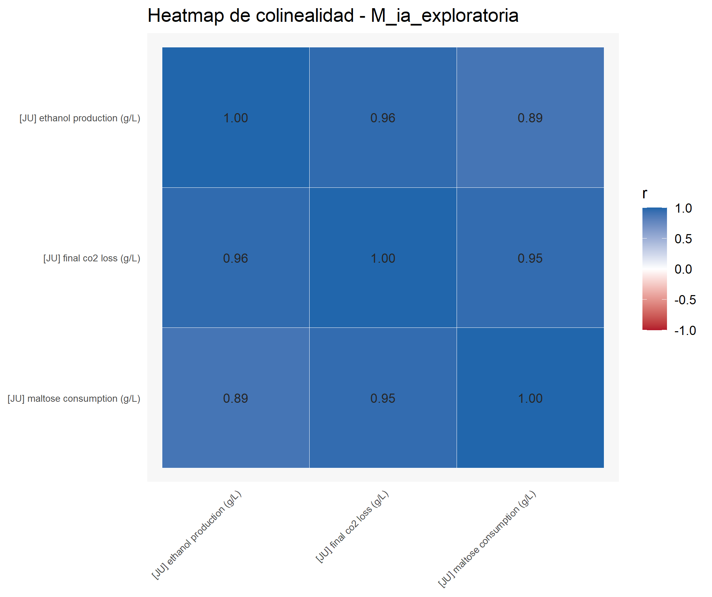{width=95%}

En el escenario sintético de IA, solo el bloque JU alcanza el umbral de colinealidad alta, con tres variables fermentativas correlacionadas entre sí (r = 0.89–0.96). Los bloques GC-FID y GC-MS no aparecen porque este escenario tiene menor cobertura química real detrás de las muestras sintéticas, así que ningún par de esas variables llega al mínimo de pares con datos en común necesario para calcular una correlación confiable.

**Escenario `M_quimica`**

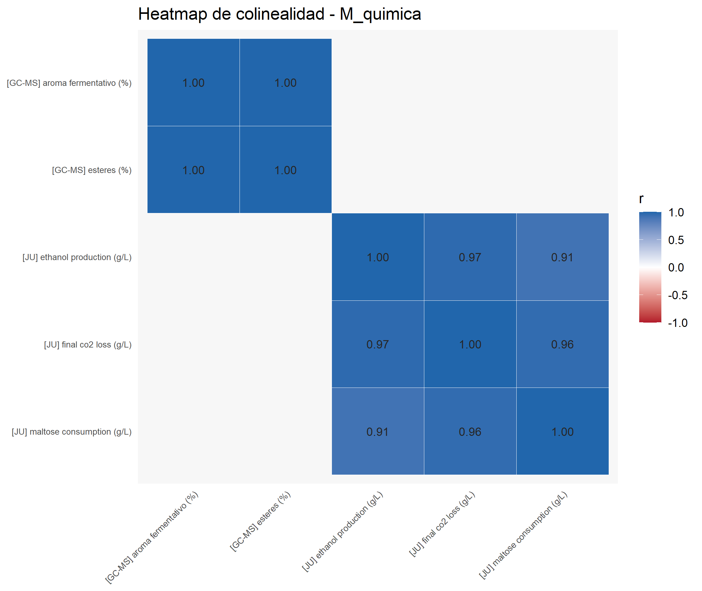{width=95%}

Esta matriz no tiene target sensorial (es solo diagnóstico de la parte química), y su heatmap muestra el caso más extremo de colinealidad interna: aroma fermentativo y ésteres de GC-MS quedan perfectamente correlacionados (r = 1.00, por construcción), y las tres variables fermentativas de JU repiten el mismo patrón visto en `M_ia_exploratoria` (r = 0.91–0.97). El bloque GC-FID no alcanza aquí el umbral porque, al no cruzarse con cata real, cambia qué unidades quedan con datos completos.

En conjunto, los cinco mapas muestran que la colinealidad es una propiedad de la química de base (se repite en `M_pura`, `M_cata_individual` y `M_expandida_evaluador` porque comparten las mismas 34 muestras), y que los bloques con menos cobertura real (`M_ia_exploratoria`, `M_quimica`) simplemente no alcanzan el mínimo de datos para mostrar todos los bloques a la vez.

## Modelos base (líneas de comparación)

```{r base-resumen}
kable(read_excel("../data/modelamiento/resultados_modelo_base.xlsx", sheet = "00_resumen_metricas"))
```

Para `M_pura` con `y_fenolico_comun`, la regresión lineal reducida logra MAE = 0.270 frente a MAE = 0.412 de la media de entrenamiento — una mejora de ~35% solo con hasta 3 predictores simples. Esto confirma que sí hay señal química aprovechable antes de pasar a los modelos más complejos, y fija la vara mínima que estos deben superar.

```{r base-fig, results='asis'}
incluir_figuras("../outputs/modelamiento/modelo_base", "\\.png$")
```

## Modelos candidatos (small data)

```{r smalldata-resumen}
kable(read_excel("../data/modelamiento/resultados_modelos_small_data.xlsx", sheet = "00_resumen_metricas"))
```

Esta tabla compara los 6 modelos candidatos con una sola pasada de validación cruzada por escenario/target — útil para ver el orden de magnitud y detectar modelos que ni siquiera superan la media de entrenamiento (columna `lectura_comparativa`), pero todavía sensible a cómo caen las particiones. La comparación que realmente define el modelo recomendado es la del bootstrap agrupado (100 iteraciones), en la siguiente sección.

```{r smalldata-fig, results='asis'}
incluir_figuras("../outputs/modelamiento/modelos_small_data", "\\.png$")
```

## Validación por bootstrap agrupado

Validación con 100 iteraciones de bootstrap, agrupando por unidad analítica para evitar fuga de información entre entrenamiento y prueba cuando una misma muestra química aparece en más de una fila (por ejemplo, distintos evaluadores en `M_expandida_evaluador`). En cada iteración se remuestrea con reemplazo a nivel de unidad química completa, se ajustan los 6 modelos candidatos y se promedian sus métricas — así el resultado deja de depender de una sola partición afortunada o desafortunada.

```{r bootstrap-resumen}
kable(read_excel("../data/modelamiento/validacion_bootstrap_cv.xlsx", sheet = "02_resumen_metricas_boot"))
```

Para `M_pura` con `y_fenolico_comun`, **Random Forest restringido** obtiene el mejor MAE bootstrap (0.271) y también el mejor R² (0.300), por delante de Ridge (MAE 0.274) y PLS (MAE 0.280) — es el modelo recomendado para el escenario principal (detalle completo de esta comparación y de por qué se eligió en la Parte 4).

```{r bootstrap-fig, results='asis'}
incluir_figuras("../outputs/modelamiento/validacion_bootstrap", "\\.png$")
```

## Sensibilidad a valores atípicos químicos

Comparación del desempeño del modelo principal (Random Forest restringido) y del modelo alternativo (Ridge) con y sin las unidades marcadas como atípicas en la etapa exploratoria (Dixon / T²-Q), para evaluar si los resultados dependen de esos puntos.

```{r sensibilidad-outliers-resumen}
kable(read_excel("../data/modelamiento/sensibilidad_outliers_quimicos.xlsx", sheet = "02_resumen_comparativo"))
```

Ambos modelos mantienen un MAE similar con y sin las unidades marcadas como atípicas (variación de un pocos puntos porcentuales, no un cambio de orden de magnitud), lo que indica que los resultados de `M_pura` no dependen de un puñado de valores extremos — un modelo frágil mostraría una caída marcada al remover esos puntos.

```{r sensibilidad-fig, results='asis'}
incluir_figuras("../outputs/modelamiento/sensibilidad_outliers", "\\.png$")
```

# - RESULTADOS FINALES {.parte}

## Objetivo de esta parte

Esta parte integra los resultados de las etapas anteriores: qué variables explican mejor la calidad sensorial fenólica, cómo se comparan los escenarios de modelamiento entre sí, qué tan robustos son los resultados frente a valores atípicos, y qué conclusiones se pueden sostener con la evidencia disponible.

Un análisis más detallado en formato de guía de defensa (con preguntas anticipadas de comisión) está disponible en `outputs/modelamiento/analisis_finales/resultados_finales_y_guia_defensa.pdf`.

## Interpretabilidad de variables

Consenso de importancia de variables entre los distintos modelos candidatos, para `y_fenolico_comun` en el escenario principal (`M_pura`).

```{r interpretabilidad-consenso}
kable(read_excel("../data/modelamiento/interpretabilidad_modelos.xlsx", sheet = "04_consenso_variables"))
```

```{r interpretabilidad-finales}
kable(read_excel("../data/modelamiento/interpretabilidad_modelos.xlsx", sheet = "05_variables_finales_tesis"))
```

```{r interpretabilidad-fig, results='asis'}
incluir_figuras("../outputs/modelamiento/interpretabilidad", "\\.png$")
```

Las variables más consistentes son fenoles volátiles medidos por GC-FID (guaiacol, p-cresol, o-cresol, 4-etil-guaiacol), lo cual es coherente desde el punto de vista químico con el atributo sensorial "fenólico" (asociado a compuestos derivados de la turba/ahumado). Variables fermentativas JU (consumo de maltosa, pérdida de CO₂, producción de etanol) aparecen como señales indirectas de apoyo, no como explicación causal directa.

## Comparación final entre escenarios

```{r comparacion-resumen}
kable(read_excel("../data/modelamiento/comparacion_escenarios_modelamiento.xlsx", sheet = "05_comparacion_escenarios"))
```

```{r comparacion-fig, results='asis'}
incluir_figuras("../outputs/modelamiento/comparacion_escenarios", "\\.png$")
```

```{r comparacion-variables}
kable(read_excel("../data/modelamiento/comparacion_escenarios_modelamiento.xlsx", sheet = "06_variables_prioritarias"))
```

### Sensibilidad a la cata individual JU: ¿cambia el modelo si se agrega?

La Parte 1 (Matriz 5) describió cómo se compone `M_cata_individual` (la matriz pura más 18 filas de una cata realizada por un solo catador, sin promedio de panel). Esta es la pregunta que esa matriz busca responder: ¿el modelo predice distinto si se agregan esas filas?

| Escenario | Modelo | MAE bootstrap | R² bootstrap |
|---|---|---:|---:|
| `M_pura` (sin JU) | Random Forest restringido | 0.271 | 0.300 |
| `M_cata_individual` (pura + JU) | Random Forest restringido | 0.330 | **0.758** |

El R² sube de 0.30 a 0.76 al agregar la cata JU — una mejora grande. Pero esto **no es evidencia de que la química explique mejor la calidad fenólica**: es evidencia de que **un solo catador es sistemáticamente más fácil de predecir que el promedio de un panel** (menos ruido de agregación, menos variabilidad entre personas). Por eso la matriz pura oficial excluye esta cata — incluirla habría inflado artificialmente el desempeño del modelo sin que la señal química fuera realmente más fuerte. Esta comparación es, en sí misma, la justificación metodológica de por qué `M_pura` es el escenario principal y `M_cata_individual` solo un análisis de sensibilidad complementario.

## Robustez de los resultados

```{r robustez-resumen}
kable(read_excel("../data/modelamiento/robustez_resultados_finales.xlsx", sheet = "00_resumen_robustez"))
```

```{r robustez-conclusiones}
kable(read_excel("../data/modelamiento/robustez_resultados_finales.xlsx", sheet = "01_conclusiones_defendibles"))
```

## Diagnóstico de residuos (modelo principal)

```{r residuos-fig, results='asis'}
incluir_figuras("../outputs/modelamiento/residuos_diagnostico", "\\.png$")
```

```{r residuos-cruce}
kable(read_excel("../data/modelamiento/residuos_diagnostico.xlsx", sheet = "09_resumen_cruce_outliers"))
```

## Conclusión

Con la matriz pura corregida (34 filas, sin cata individual JU), la clasificación por nombre de los compuestos GC-MS de Constanza incorporada al pipeline (ver Parte 1, sección "Clasificación de compuestos GC-MS por familia química"), y una corrección de reproducibilidad en la validación bootstrap (la semilla aleatoria pasó de ser única y dependiente del orden de los escenarios, a una semilla fija por escenario-target), **Random Forest restringido** es el modelo principal para `y_fenolico_comun`, tanto por MAE bootstrap (0.271, mejor que Ridge con 0.274) como por R² (0.30, mejor que Ridge con 0.05) y estabilidad de error. Este resultado se mantuvo estable a través de las tres correcciones metodológicas del pipeline, lo que da confianza adicional en que no es un artefacto de una corrida particular. Ridge y PLS se mantienen como alternativas relevantes por su interpretabilidad y manejo explícito de la colinealidad entre predictores químicos — algo central en un contexto de *small data* con bloques analíticos no solapados.

Las variables más coherentes y estables para explicar la calidad fenólica son los fenoles volátiles cuantificados por GC-FID (guaiacol, p-cresol, o-cresol y 4-etil-guaiacol), lo que es consistente con la química conocida del carácter ahumado/fenólico del whisky. El análisis de sensibilidad confirma que estos resultados no dependen críticamente de un pequeño número de observaciones atípicas: el desempeño del modelo se mantiene comparable al excluir las unidades marcadas como atípicas en la etapa exploratoria.

La comparación entre escenarios aporta un hallazgo metodológico relevante: al agregar la cata individual JU a la matriz pura (`M_cata_individual`), el desempeño del modelo sube notoriamente (R² cercano al que se observaba antes de excluir JU por error). Esto confirma que gran parte de la señal "fácil" de versiones anteriores del análisis provenía específicamente de la cata de un solo evaluador, más fácil de predecir que el promedio de un panel — y refuerza que la exclusión de JU de la matriz principal fue la decisión metodológicamente correcta, no una pérdida de información sino una corrección de rigor.

En conjunto, la evidencia respalda que la calidad fenólica del whisky chileno estudiado está asociada de forma identificable y razonablemente estable a un grupo acotado de compuestos fenólicos volátiles, en un contexto donde el tamaño muestral impone límites claros a la magnitud de las conclusiones: este estudio se entiende como exploratorio / prueba de concepto, no como un modelo predictivo listo para uso industrial.

## Escenarios complementarios y su rol

- **`M_expandida_evaluador`**: no mejora sustancialmente el desempeño respecto a la matriz pura promediada; se mantiene como evidencia complementaria, no como reemplazo.
- **`M_ia_exploratoria`**: catas sintéticas de consenso IA (Gemini/Claude/GPT), presentadas siempre como escenario exploratorio — nunca como sustituto de una cata real — pero con desempeño interesante que abre una línea futura de uso de IA como herramienta exploratoria complementaria en investigación sensorial de small data.
